# Module 1 - Setting up the environment

🎓 **Level**: 100 (Beginner)

⌛ **Estimated time to complete this lab**: 15 minutes

## Objectives

This module guides you through deployment of the Microsoft Security Copilot solution that will be used in all subsequent modules.

### Prerequisites

To get started with Microsoft Security Copilot and Microsoft Sentinel, you must have a Microsoft Azure subscription with a work/business email. If you do not have a subscription, you can sign up for a free account [here](https://azure.microsoft.com/en/free).

- An Azure subscription with a work/business email
<!---- Permissions to create a resource group in your Azure subscription--->
- Note: Installing Security Copilot and Sentinel for the very first time in a subscription needs Global Admin permission

Microsoft Security Copilot has an SCU cost ($4 per hour per SCU). This must be configured in order to complete the Beginner and Advnaced hands-on exercises. If any other prompts are executed during the hands-on exercises, you may not be able to complete all the modules.

<!---Microsoft Sentinel provides a "trial mode" where data ingestion up to 10GB/day is free for the first 31 days when first added to a workspace. Sentinel will prompt that it is in trial mode once installed.--->

### Exercise 1: Deploy Security Copilot 

In this exercise, we will show you how to create a brand new Microsoft Security Copilot workspace to store your data. If you already have a pre-existing one that you would like to use, you can skip to Exercise 2.

1. Sign in to Security Copilot (https://securitycopilot.microsoft.com).

2. Select Get started.

   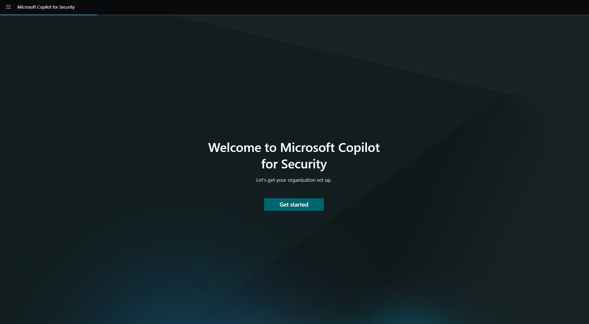

3. Set up your security capacity and please fill out the form as follows:
- **Azure Subscription**: Choose the Azure subscription where you would like to deploy the Microsoft Security Copilot workspace.
- **Resource Group**: Select an existing resource group or create a new resource group that will host Security Copilot.
- **Capacity Name**: Please type in "**CopilotForSecurityLab**" but if you would like to create your own name then please keep note for Exercise 2.
- **Prompt evaluation location**: This location will affect where your prompts are evaluated and processed.
- **Allow Global Prompt evaluation**: Leave this box unchecked. This is to ensure data is processed within region.
- **Security compute units**: The number of SCUs needed to process each prompt request.
  - To complete the Beginner and Advanced Modules, it is recommended that you enter 8 SCUs
  <!--- To complete the Beginner, Advanced and Additional Modules, it is recommended that you enter 15 SCUs 
  - If you have already completed the Beginner & Advanced Modules and returning to complete the Additional Modules only, it is recommended that you enter 8 SCUs --->

   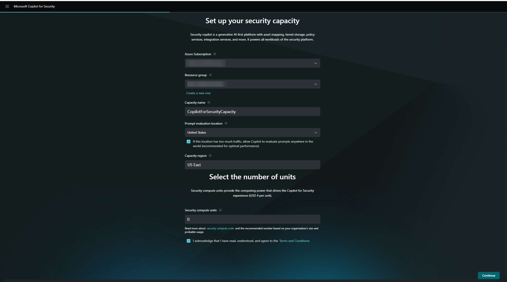

4. Confirm that you acknowledge and agree to the terms and conditions, then select Continue.

   After you've created the capacity, it will take a few minutes to deploy the Azure resource on the backend.

   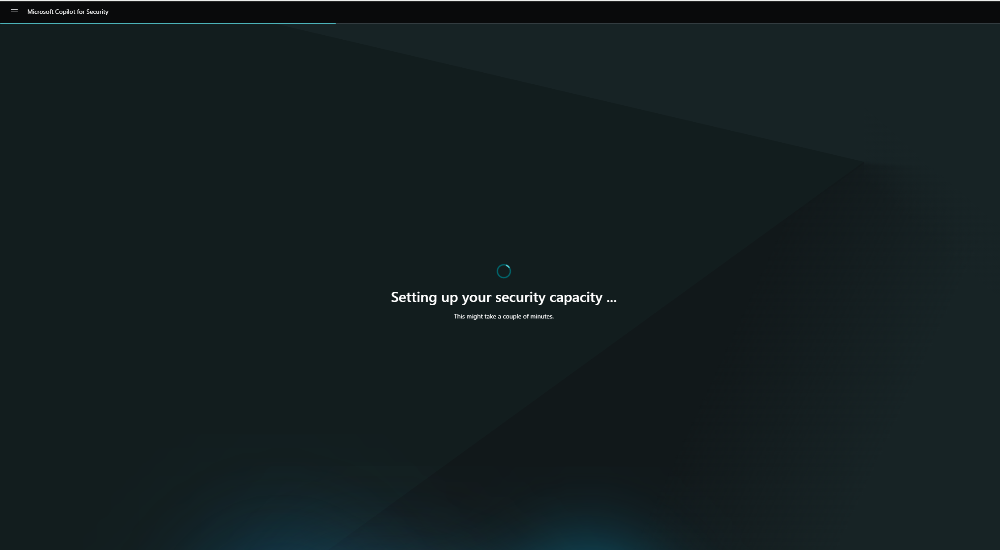

5. Associate your capacity to the Security Copilot environment if the capacity was created in the Azure portal.

   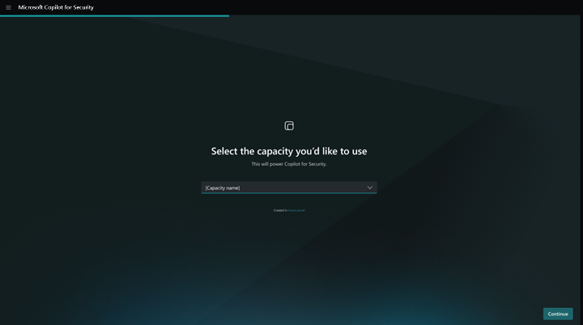

6. You're informed where your Customer Data will be stored. Select Continue.

   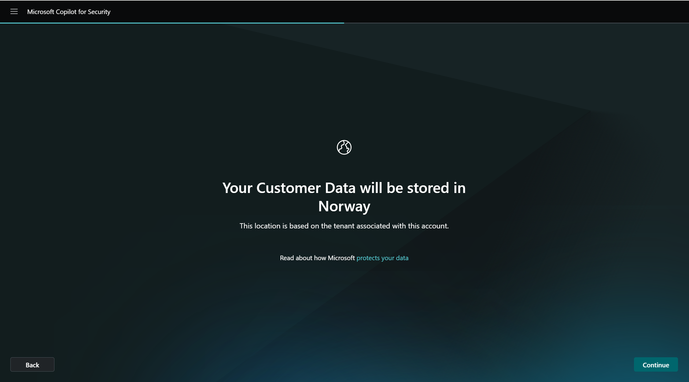

7. You're informed on accessing data from Microsoft 365 services. Select Continue.

8. Select among the data sharing options. Select Continue. For more information on data sharing, see [Privacy and data security](https://learn.microsoft.com/en-us/copilot/security/privacy-data-security).

   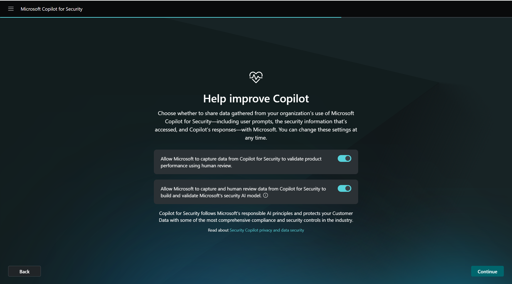

9. You'll be informed of the default roles that can access Security Copilot. Select Continue.

    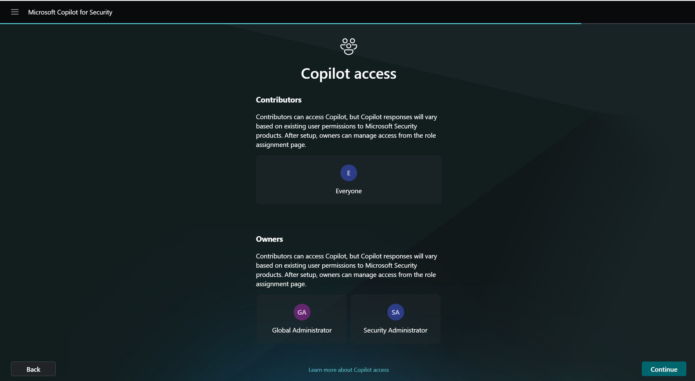

10. A confirmation page is displayed. Select Finish.

    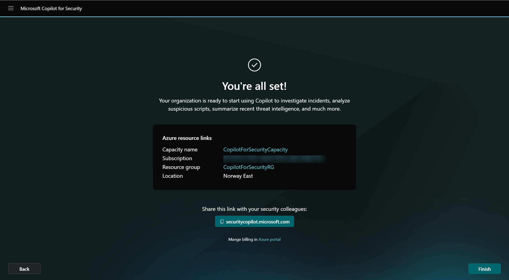

<!---1. Click the "Deploy to Azure" button below.

   

2. When the new browser window opens, you should be redirected to the Azure portal. Please fill out the form as follows:
   - **Subscription**: Choose the Azure subscription where you would like to deploy the Microsoft Security Copilot workspace.
   - **Resource Group**: Select an existing resource group or create a new resource group (recommended) that will host Security Copilot.
   - **Capacity Name**: This will be hardcoded as "CopliotForSecurityTrainingLab"
   - **Location**: This location will affect where your prompts are evaluated and processed.
   - **Number of Units**: The number of SCUs needed to process each prompt request.

   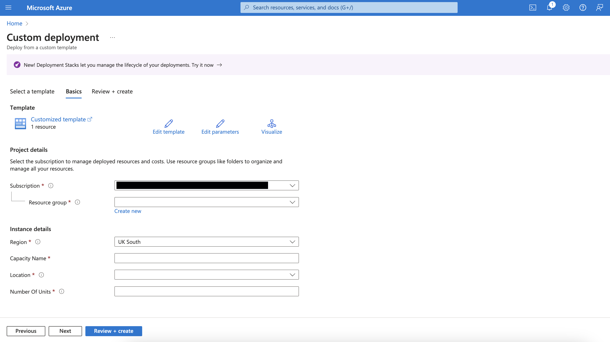

   Click **Review + create** and then **Create** after the validation completes. The creation takes a few seconds.--->

<!--- ### Exercise 2: Deploy the SCU Timer Logic App 

In this exercise, we will show you how to create a Logic App which will delete the SCU Microsoft Security Copilot resource after 3 hours to ensure that there are no additional charges once the exercises are completed.

If you could not complete the lab previously and are returning to resume, then go to the Logic App and run manually. Please [click here](../Modules/ResumeLab.md) for the steps to manually run the Logic App.

1. Click the "Deploy to Azure" button below.

      

3. When the new browser window opens, you should be redirected to the Azure portal. Please fill out the form as follows:
   - **Subscription**: Select the same Azure subscription from Exercise 1
   - **Resource Group**: Select the same resource group from Exercise 1
   - **Region**: This will be selected automatically based on the resource group
   - **Capacity Name**: This will default to "CopilotForSecurityLab". If you changed the name in Exercise 1 then please make sure the name is the same.

   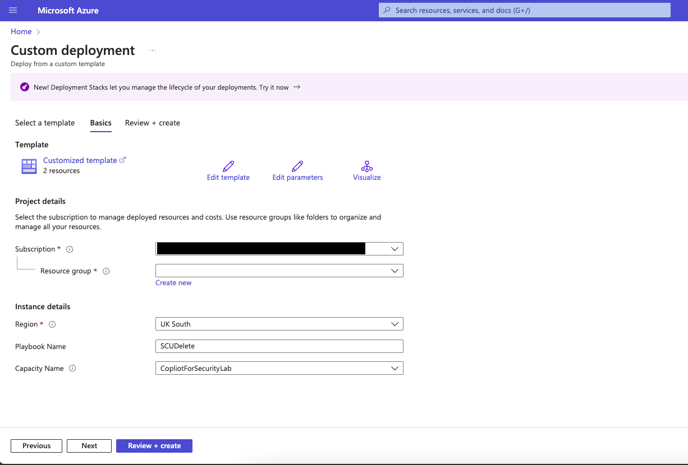
  
   Click **Review + create** and then **Create** after the validation completes. The creation takes a few seconds.
   
4. You will be redirected to the the Microsoft Template Overview page. After a few seconds you will find 2 resources loaded which can be found in the Deployment details section as in the screenshot below. Please click on the Logic App resource (named SCUDelete in the screenshot).

   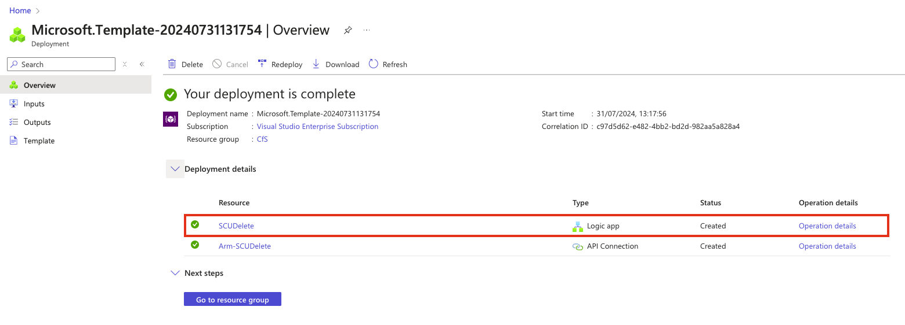

5. Click on "Logic app designer" nested under Development Tools located in the sidebar and then click on "Delete a resource". All the parameters will open on the right hand side of the screen.
6. Click on "Change connection"

   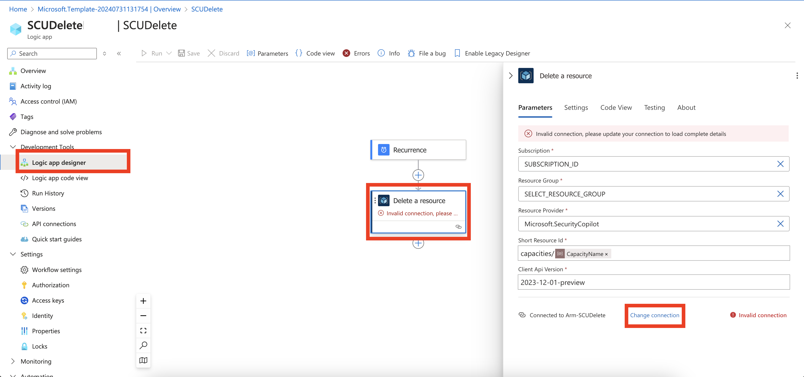

7. Click the "Add new" button
8. Make sure "OAuth" is selected in the Authentication drop down list and  the tenant which is hosting the subscription from exercise 1 ("Default Directory" in the example screenshot)  is selected in the Tenant ID drop down list. Finally click the blue "Sign in" button.

   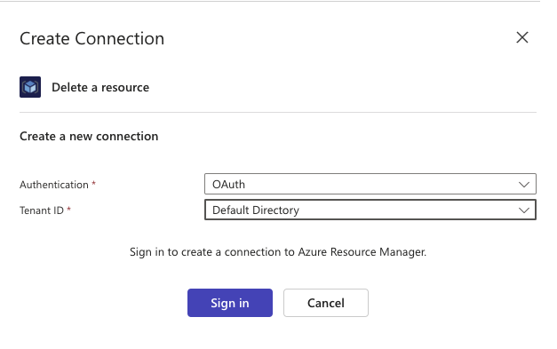

9. In the popup window select the current logged in user to authenticate into the Azure Resource Manager
10. Click the "X" located in the Subscription field and select the same subscription from Exercise 1
11. Click the "X" located in the Resource Group field and select the same Resource Group from Exercise 1
12. Click "Save" located at the top of the screen

    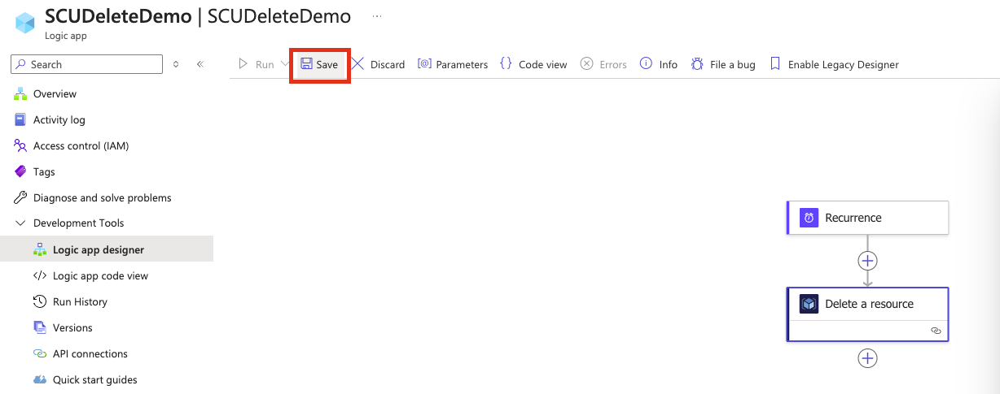

13. Click on "Overview" and then click "Enable" which is located at the top of the screen --->

Click [here](Module-2-Script-analysis.md) to complete the next Module.
