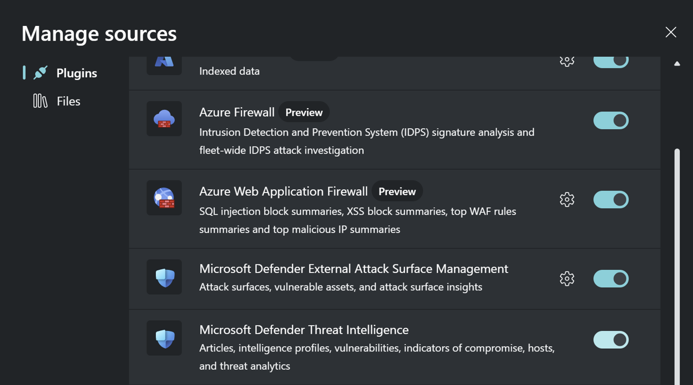
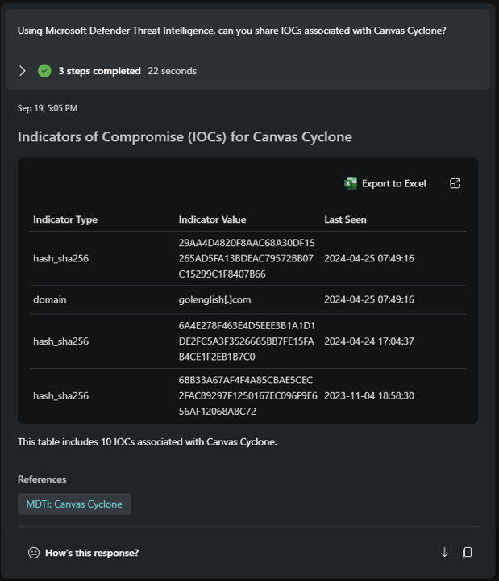

# Module 3 - How to leverage Threat Intelligence using Copilot for Security

🎓 **Level: 100 (Beginner)**

⌛ **Estimated time to complete this lab: 15 minutes**

## Objectives
This module guides you through how to use Copilot for Security for use case scenarios tailored for Threat Intelligence.

### Prerequisites
- You must have completed Module 1 or have an existing instance of Copilot For Security installed. If you do not have a working instance of Copilot for Security, please [click here to complete Module 1](..Modules/Module-1-Setting-up-the-the-environment.md#module-1---setting-up-the-environment).
- The plugin for Microsoft Defender Threat Intelligence must be enabled on Copilot for Security.

[](../Images/pluginthreatintel.png)


### Exercise 1: Get Recent Threat Intelligence
1. Access the Prompt Bar
- Proceed to the prompt bar and type the following prompt:
  ```
  Using Microsoft Defender Threat Intelligence, summarize recent threat intelligence.
  ```
2. Review the result.

[](../Images/Threat%20intellogence%20prompt%201.png)

*Expectation: Summarization of recently published threat intelligence.*


### Exercise 2: Get Information on Vulnerabilities (CVEs)
1. Access the Prompt Bar
- Proceed to the prompt bar and type the following prompt:
  ```
  Using Microsoft Defender Threat Intelligence, can you share the CVEs published in the last week? Include the published date and give me the response in a table.
  ```
2. Review the result.

[](../Images/Threat%20intellogence%20prompt%202.png)

*Expectation: Summarization of recent CVEs published by the NVD in the last week.*

3. Access the Prompt Bar
- Proceed to the prompt bar and type the following prompt:
  ```
  Using Microsoft Defender Threat Intelligence, can you share details associated with CVE-2021-44228 in terms of technologies it impacts?
  ```
4. Review the result.

[](../Images/Threat%20intellogence%20prompt%203.png)

*Expectation: Summarization of technologies impacted by the CVE.*

5. Access the Prompt Bar
- Proceed to the prompt bar and type the following prompt:
  ```
  Using Microsoft Defender Threat Intelligence, can you recommend actions to put in place to protect my organization against CVE-2021-44228?
  ```
6. Review the result.

[](../Images/Threat%20intellogence%20prompt%20CVE.png)

*Expectation: Recommendations of actions to protect against CVE.*

### Exercise 3: Use Threat Intelligence to Get Information on Threat Actors
1. Access the Prompt Bar
- Proceed to the prompt bar and type the following prompt:
  ```
  Can you provide more information on the threat actor Canvas Cyclone using Microsoft Defender Threat Intelligence? Please include details on their TTPs (Tactics, Techniques, and Procedures) and any other relevant information.
  ```

2. Review the result.

[](../Images/Threat%20intellogence%20prompt%204.png)

*Expectation: Information on threat actor and associated CVEs.*


3. Access the Prompt Bar
- Proceed to the prompt bar and type the following prompt:
  ```
  Using Microsoft Defender Threat Intelligence, can you share IOCs associated with Canvas Cyclone?
  ```

4. Review the result.

[](../Images/IOCThreatactors.png)

*Expectation: List of indicators associated with the threat actor.*

Click [here](Module-4-Summarization-of-data.md) to complete the next Module.
