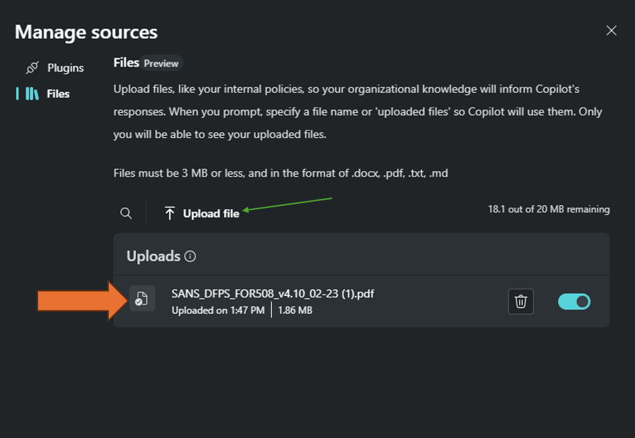

# Module 6 - Using a Knowledge Base in Copilot for Security 

#### ⌛ Estimated time to complete this lab: 20 minutes
#### 🎓 Level: 200 (Proficient)

### Objectives
Upon completing this technical guide, you will gain the following abilities:
* Add sample files to Copilot for Security

### Scenario
In this technical workshop, participants will learn how to upload a file to Copilot for Security. To successfully complete this task, you must meet the following prerequisites:
* You need your own tenant and Microsoft Copilot for Security instance.
* Access to the sample files folder.

## Exercise 1: Upload a File to Copilot for Security 

### Overview of File Upload Feature
[Learn more](https://learn.microsoft.com/en-us/security-copilot/upload-file)

1. Check that the file you're about to upload is a common text file type like DOCX, MD, PDF, and TXT formats, and that each file doesn't exceed 3 MB. You can upload files up to 20 MB in total.
2. In the Copilot home page, select the sources icon in the prompt bar to open the Manage sources page.
3. Select "Files" to open the file upload section. You can use the sample files from the following [SampleFiles folder](../SampleFiles) 




4. Select "Upload file" to look for your file. For this workshop, we will use the following sample file:
   - Hunt Evil Poster SANS (SANS_DFPS_FOR508_v4.10_02-23 (1).pdf)
5. Wait for the file to appear in uploads. If an error message appears, correct the problem and try again.
6. To include the file as a source in your current session, toggle the button beside the file until the toggle is on the right (lit up). If you aren't going to use the file yet, or want to exclude the file as a source in your current session, keep the toggle button untoggled (toggle is on the left, in grey).

### Scenario
In this technical workshop, participants will learn how to search for documents and leverage the information in practical security operation scenarios. To successfully complete this task, you must meet the following prerequisites:
* You need your own tenant and Microsoft Copilot for Security instance.
* Uploaded files from the previous exercise.

## Exercise 2: Prompting  an Uploaded File in Copilot for Security 

### 1. Access the SANS ("Hunt Evil Poster Document")
- Access the document from the samples folder in the GitHub here: [Hunt Evil Poster PDF](https://github.com/Azure/Copilot-For-Security/blob/main/Technical%20Workshops/Knowledge%20base%20Workshop/Sample%20Files/Hunt%20Evil%20Poster.pdf) or from the [SANS website](https://www.sans.org/posters/hunt-evil/).


- Ensure the document is added to your file upload capability in Copilot for Security.

### 2. Prompting Uploaded Files Using Copilot for Security 
- Send out the first prompt querying the data in the document. We will focus on a couple of scenarios. In the Hunt Evil document, we will focus on pulling information associated with lateral movement, particularly on how it's achieved with remote access or remote execution.

**Prompt 1:**
```
Could you show me the event IDs associated with remote execution from the SANS_DFPS_FOR508_v4.10_02-23 (1).pdf document from the uploaded files in a table format?

```


**Prompt 2:**
```
Leveraging the above event IDs, hunt my defender environment for any events associated with them.
```


Click [here](Module-7-Microsoft-Sentinel-Copilot-For-Security-Scenarios.md) to complete the next Module.
