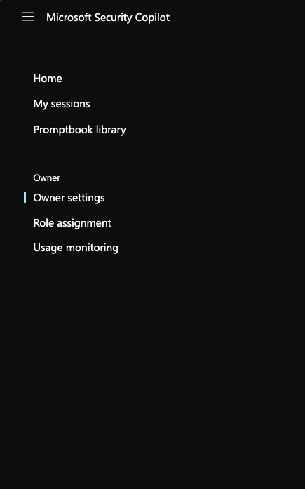

# Adding more SCUs

🎓 **Level**: 100 (Beginner)

⌛ **Estimated time to complete this lab**: 15 minutes

## Objectives

This module guides you through how to add SCUs to complete the Additional Modules

### Prerequisites

- Security Copilot must be enabled

- User must have Azure Owner or Contributor permission to adjust the SCU count 

### Exercise 1: Adding SCUs 

In this exercise, we will show you how to add more SCUs in order to complete the Additional Modules 

1. Sign in to Security Copilot (https://securitycopilot.microsoft.com).

2. Click the burger button located in the top left corner and then click Owner Settings.
   

3. Under Overview, click Switch Capacity.
   
4. Change the SCU count to 15 and click Apply.

## You have now added more SCUs and can continue to the Additional Modules...

- To progress to Module 9: Embedded Features in Microsoft Defender, click [here](Module-9-Embedded-Features-in-Microsoft-Defender.md)

- To progress to Module 10: Embedded Features in Microsoft Purview, click [here](Module-10-eDiscovery-Search-in-Microsoft-Purview.md)

- To progress to Module 11: Embedded Features in Microsoft Intune, click [here](Module-11-Embedded-Features-in-Microsoft-Intune.md)

- To progress to Module 12: Embedded Features in Microsoft Entra, click [here](Module-12-Embedded-Features-in-Microsoft-Entra.md)

