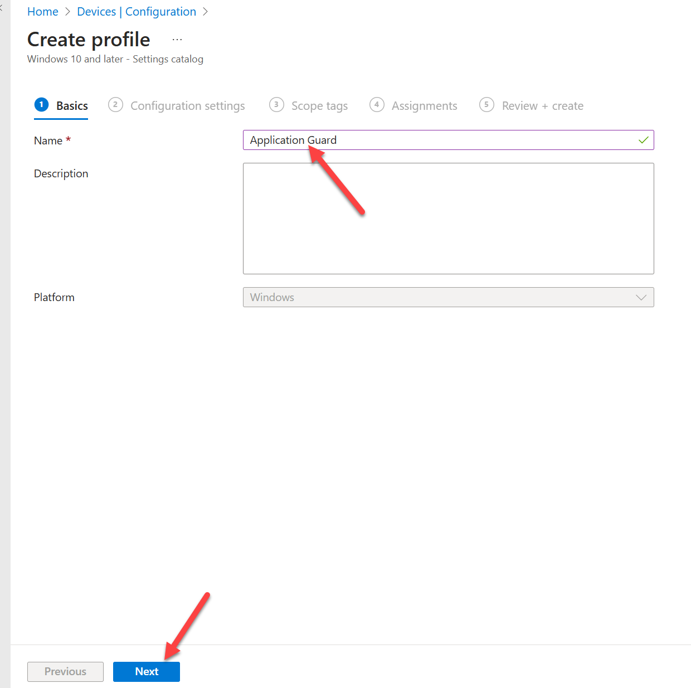

<h1> Module 11 -Embedded Features in Microsoft Intune</h1>
<h4>🎓 Level: 200 (Advanced)<h4>
<h4>⌛ Estimated time to complete this lab: 30 minutes</h4>
<h2>Objectives </h2>

This module showcases some powerful features that become available in Microsoft Intune when Microsoft Security Copilot is enabled. Features focus on improving device posture meaning ensuring you are running the most secure build, understanding details about assets, quickly understanding the impact of existing policies, comparing devices and other useful details obtained at machine speed. 

<h4>Note: Similar outcomes can be accomplished using the standalone Microsoft Security Copilot dashboard as seen within the embedded experience. </h4>
<h2>Prerequisites </h2>

* You have Microsoft Security Copilot enabled

* You have added the necessary amount of SCU's to complete the Additional Modules (15 SCUs if continuing directly on from the Beginner and Advanced Modules or 8 if you have re-installed Security Copilot).

* You must have access to Microsoft Intune in the same tenant as Microsoft Security Copilot so Security Copilot features are available in Microsoft Intune  

<h2>Exercise 1: Accessing Microsoft Intune and analyzing a device</h2>

At this point, we assume you have completed step one and have at least read only access to Microsoft Intune, which exists in the same tenant as Microsoft Security Copilot. 

1: Go to Intune.microsoft.com. This will bring you to the main Intune dashboard. Let’s click devices on the left to take us to the Device overview page. On that page, choose your Windows devices. 

2: Now pick a system and click it. I’m choosing one that is out of compliance. 

<h4>Note: You could just hover next to a device and you will see a Security Copilot button popup allowing you to access the AI-generated insights on that device. </h4>

3: Now click Explore this device. You may also see Copilot (preview) pop up to advertise what we are about to get into. 

4: If you have the overview pop up, click "not now". You should see some Copilot AI-generated insights available to choose to quickly understand the device of interest. 

5: Let’s try out "Summarize this device". It should take a few seconds and generate a nice summary of the current state of this device. Noice there are other options on the bottom such as seeing what is installed on this device.

6: Try clicking what apps are installed. It will ask the App type, which for my example, I’m choosing "Managed apps" and clicking submit. 

<h2>Exercise 2: Analyzing error code</h2>

7: Click the x to close out the pop up and select "Analyze error code"

8: Once again, you may see the Copilot pop up advertising what we are about to get into. Choose to Dismiss that and you will find an Error Code bar you can fill in to analyze a error code. This is where you can put in error codes to analyze. 

9: When you submit an error code, you will get a quick explanation of what it is. This is a much better approach to understanding error messages vs searching the Internet for an explanation. 

<h2>Exercise 3: Comparing devices</h2>

10: Now let’s close that and move on to the next topic, which is using AI to quickly compare two devices. Click "Compare to another device"

11: This will bring up a window asking for another device to compare against as well as what you are comparing for. Try putting in another device ID and choose an item to compare against. For my example, I'm going to compare "Configuration profiles". 

<h2>Exercise 4: Comparing devices with AI help</h2>

12: Now let’s close the pop up and move on to the next topic. Click on the left devices. 

13: Now click Configuration

14: Now let’s choose to build a new Policy by clicking "Create". Then click "New Policy"

15: This will bring up a pop up. Let’s build a policy profile for Windows 10 or Later and use the profile type "Settings catalog". Click create

16: Let’s give it a name and click "next"

17: Now you will see the Configuration settings options. Click +Add settings. This will bring up the Settings picker. Within that, choose Microsoft Edge, then from that drop down choose Application Guard settings. Click select all these settings. 

18: Click the X on the top corner to close the popup. You will see more Application Guard settings. A common challenge is understanding what all these configuration settings mean. You can click on the Security Copilot button to get a explaining of what the setting means. For example, I’m looking at what Application Guard Container Proxy means. On the right, a pop up comes up explaining all the details of what this configuration setting can do. 

<h2>Exercise 5: Summarize More Details</h2>

19: Now let’s close that popup and go back to Devices. Another point to explore how AI can summarize different configuration settings within Microsoft Intune. Click a device and select a policy configuration to explain. I'll pick an example of Purview Edge browser extension. You can pick any one you have within your environment. 

 
20: Within policies, you will see the "Summarize with Copilot" to get details of the policy. 

21: This can be super helpful to quickly understand what policies you have and help with decisions on when to use or remove such policies. 

<h2>Exercise 6: Run a query</h2>

22: Next, let’s close that and click devices. Then click "All devices" and choose a device. 

23: Now let’s choose "Device query". Then click Query with Copilot. 

You will see options to query Copilot against. For example, I'll choose "show me all active processes". 

You can also choose to add processes. Click add and run.

You will see the results of what is running on the endpoint. 

<h4>These are just some of the powerful capabilities that become available when Microsoft Security Copilot is enabled in your environment.</h4>

Please click <a href="Module-12-Embedded-Features-in-Microsoft-Entra.md">here</a> to go to the next Advanced Module (Microsoft Entra) or click <a href="Deleting-SCU.md">here</a> to delete the SCUs and complete the course.
