<h1> Module 12 -Embedded Features in Microsoft Entra</h1>
<h4>🎓 Level: 200 (Advanced)<h4>
<h4>⌛ Estimated time to complete this lab: 30 minutes</h4>
<h2>Objectives </h2>

This module showcases some powerful features that become available in Microsoft Entra when Microsoft Security Copilot is enabled. Features focus on improving speed troubleshooting suspicious sign-ins, investigating identity risks, and creating lifecycle workflows for user onboarding, role change, or termination. 

<h4>Note: Similar outcomes can be accomplished using the standalone Microsoft Security Copilot dashboard as seen within the embedded experience. </h4>
<h2>Prerequisites </h2>

* You have Microsoft Security Copilot enabled

* You have added the necessary amount of SCU's to complete the Additional Modules (15 SCUs if continuing directly on from the Beginner and Advanced Modules or 8 if you have re-installed Security Copilot).

* You must have access to Microsoft Entra in the same tenant as Microsoft Security Copilot so Security Copilot features are available in Microsoft Entra  

<h2>Exercise 1: Accessing Microsoft Entra and Using Security Copilot Chat</h2>

1. For this module, lets work through some Security Copilot capabilities found within Microsoft Entra. Start by going to Entra.Microsoft.com. The first thing you should see if Security Copilot is enabled in your tenant is the Security Copilot button. Click that to open the chat window. 

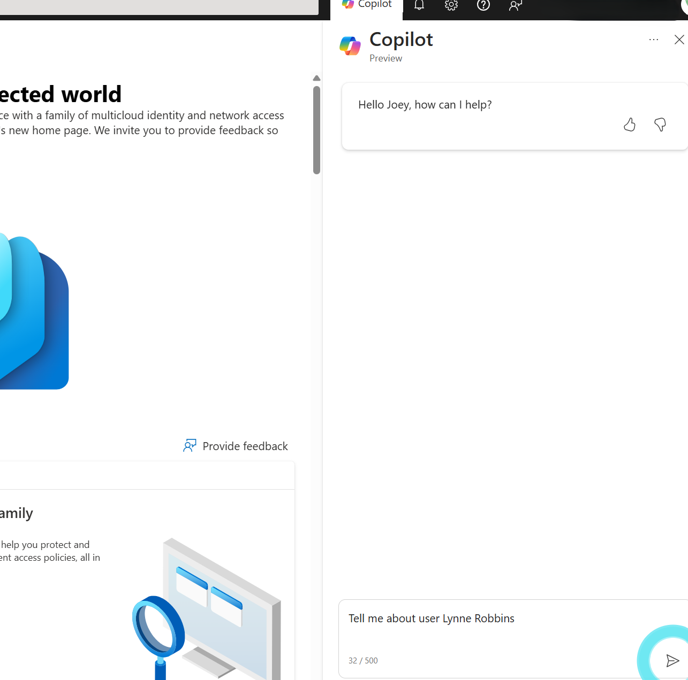

2. Try searching for one of your users using the prompt "tell me about" such as the example shown. 

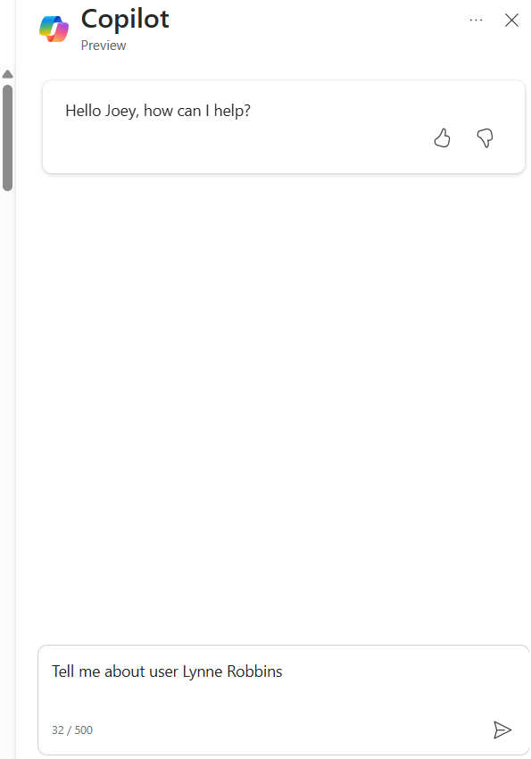

3. You should see a good summary of the recent user behavior. My example shows some concerns about Lynn. 

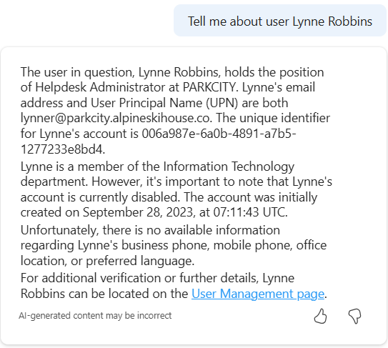

4. Security remembers context, so you can continue the conversation if you find you need to know more about a user. For my example, I’m asking to see the Entra audit logs over the last week. Notice how Security Copilot gives me a nice summary. Try it with your user. 

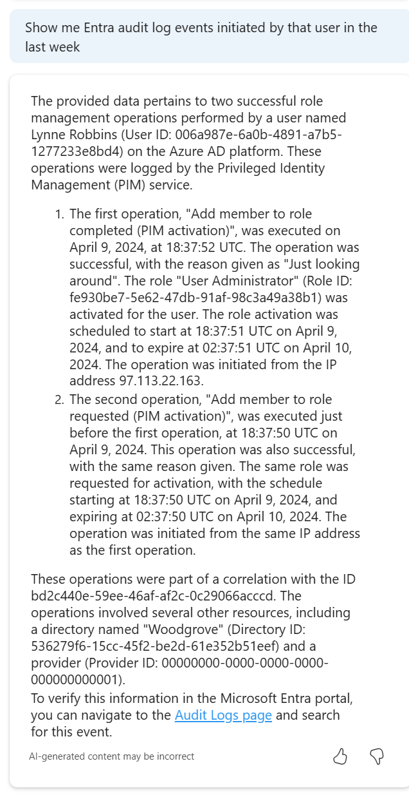

5. Another common interest is seeing how and where a user of interest is signing into resources. In my next example, I'm asking about the sign-ins. Try that with your user example. 

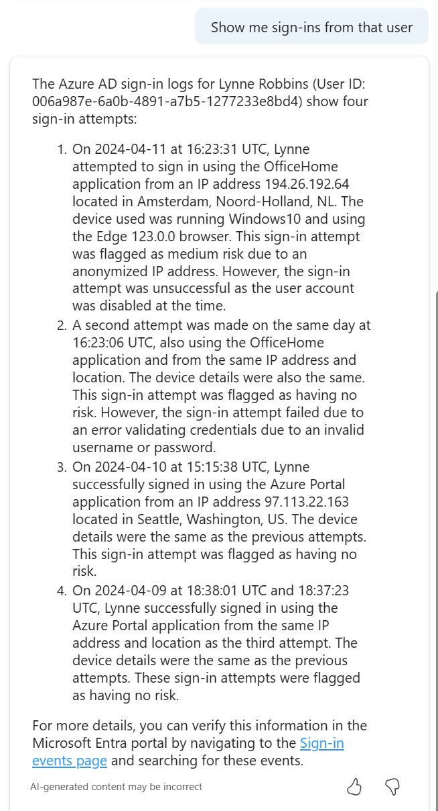

<h2>Exercise 2: Troubleshooting Access Failures</h2>

6. Now lets get a little more tactical with our next Entra use case. A common situation is troubleshooting why somebody, or something is having access failure. There could be many reasons that lead to a ticket being opened asking engineering to figure out what is going on, how to fix it, and what risks are associated meaning should they open it or consider it a potential account compromise / policy violation. Security Copilot can dramatically improve the speed to get these answers. 

For this example, let’s start off by asking Security Copilot in Entra about a account that is having access problems to a resource. In my example, I’m asking to tell me about the account. You can see in my example, I get details such as who the user is and various details (I’ve blocked out some of these even though it’s a lab environment). 

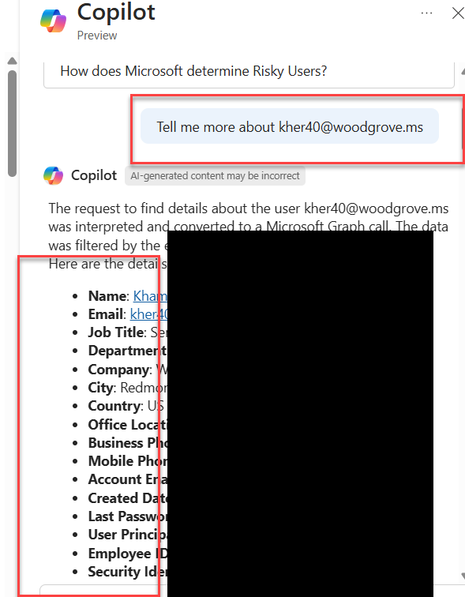

7. Since we are troubleshooting a sign-in issue, next I'll ask to see the most recent failed sign-in using the prompt "Show me kher40@woodgrove most recent failed sign ins". The results give me various details including the resource being accessed, device details used during the access process, risk, token info, etc. There is a lot of info that is provided. Try it with one of your accounts. 

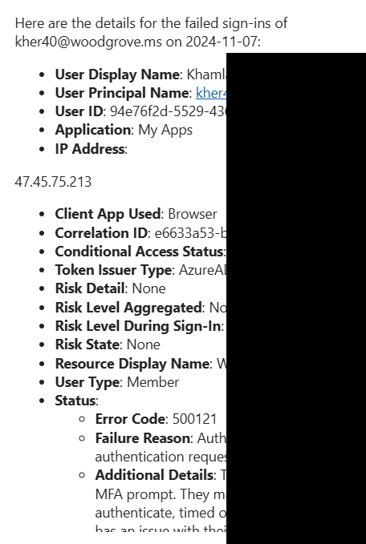
8. This may be enough to understand the issue. You may also have other questions that need answering such as the associated risk with this specific failed session. You could ask Security Copilot "was there any unusual or risky behaviors for kher40@woodgrove sign in attempt?" to get an opinion on potential risk. My example doesn't show any major risk factors to consider. 

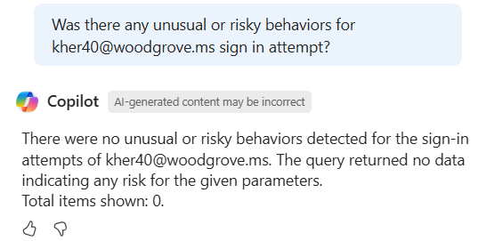

9. If you don't understand something about the findings, you could always ask Security Copilot to explain it. For example, I'll ask which authentication methods are considered MFA. 

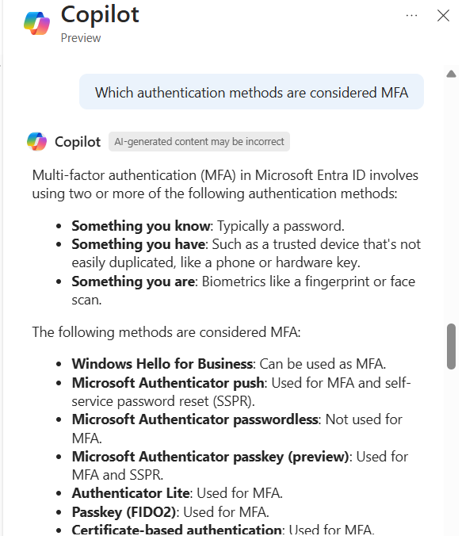

10. You may want to check certain configuration or settings via asking Security Copilot. For my example, I'll ask if my user is registered for FIDO2 authentication. Security Copilot will show me such details. 

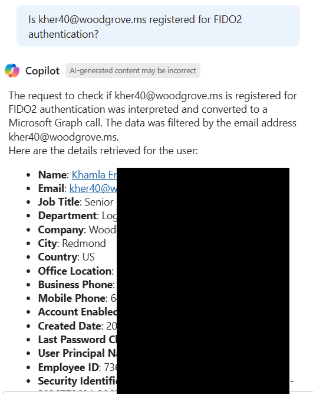

11. One final thing to consider is asking Security Copilot how to improve things. For my example, I'll ask how to setup password less for this account. Security Copilot will provide a walk through on how to make this configuration. 

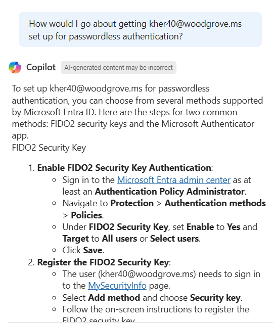

Try out any of these prompts to see how Security Copilot can improve your Entra troubleshooting experience.

You have now completed this module, please click <a href="Deleting-SCU.md">here</a> to delete the SCUs and complete the course.
