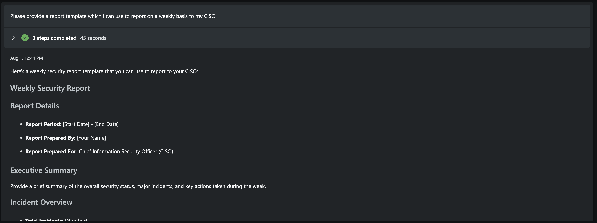

# Module 4 - Leveraging Copilot for Security for data summarization and reports

🎓 **Level: 100 (Beginner)**

⌛ **Estimated time to complete this lab: 15 minutes**

## Objectives
This module guides you through how to use Copilot for Security for summarization of data to help with reporting.

### Prerequisites
- You must have completed Module 1 or have an existing instance of Copilot For Security installed. If you do not have a working instance of Copilot for Security, please [click here to complete Module 1](..Modules/Module-1-Setting-up-the-the-environment.md#module-1---setting-up-the-environment).
- The plugin for Microsoft Defender Threat Intelligence must be enabled on Copilot for Security.

[](../Images/pluginthreatintel.png)

## Exercise 1 - Summarization of vulnerability Data

1. Access the Prompt Bar
- Click on Microsoft Security Copilot in the top left corner to start a new session then proceed to the prompt bar and type the following prompt:
  ```
  Summarize CVE-2018-20062 vulnerability
  ```

2: Review the result.


*Expectation: Information on the technical details of the CVE.*


3. Access the Prompt Bar
- Click on Microsoft Security Copilot in the top left corner to start a new session then proceed to the prompt bar and type the following prompt:
  ```
  /AskGPT Write a summary to a non-technical audience
  ```
4. Review the result.


*Expectation: Explanation of the CVE with no techincal details.*


## Exercise 2 - Using Copilot for Security for reports

1. Access the Prompt Bar
- Click on Microsoft Security Copilot in the top left corner to start a new session then proceed to the prompt bar and type the following prompt:
  ```
  /AskGPT Can you recommend a security implementation plan to deal with ransomware in my organization ,phase out the plan in form of Immediate actions ,short term actions and long term actions, this should be consumable to a technical audience
  ```
2. Review the result.


*Expectation: Template which can be used to create a ransomware policy.*


3. Access the Prompt Bar
- Click on Microsoft Security Copilot in the top left corner to start a new session then proceed to the prompt bar and type the following prompt:
  ```
  /AskGPT Generate an incident response plan that i can use in my organization to respond to high severity incidents associated with critical assets in my organization
  ```
4. Review the result.


*Expectation: Generic incident response plan.*

5. Access the Prompt Bar
- Click on Microsoft Security Copilot in the top left corner to start a new session then proceed to the prompt bar and type the following prompt:
  ```
  /AskGPT Please provide a report template which I can use to report on a weekly basis to my CISO
  ```
6. Review the result.



*Expectation: Template with headings which can be used to produce weekly report to the CISO.*

7. Access the Prompt Bar
- Click on Microsoft Security Copilot in the top left corner to start a new session then proceed to the prompt bar and type the following prompt:
  ```
  /AskGPT Write a sample mobile device policy for my organization
  ```
8. Review the result.


*Expectation: Sample mobile device policy.*

You have now completed the beginner training of Copilot for Security. If you would like to continue to the more advanced use cases then please click [here](Module-5-Generating-KQL-queries.md) for Module 5 or click [here](Deleting-SCU.md) to delete the SCU capacity to ensure there are no additional costs.

