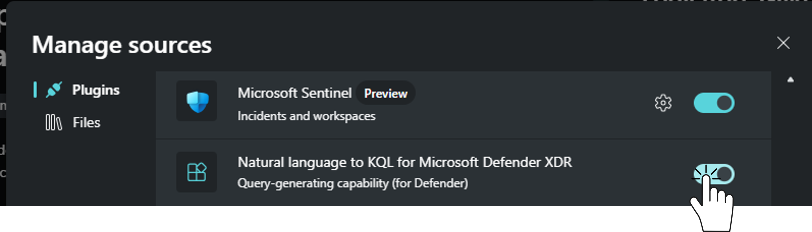
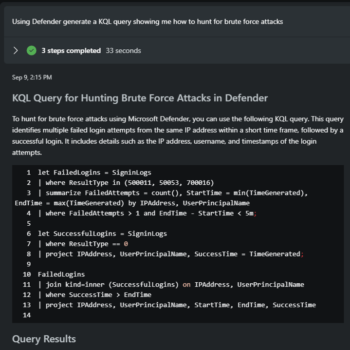
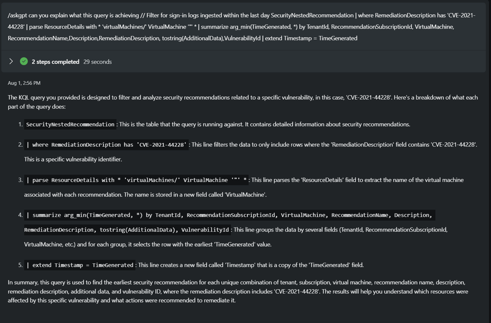

# Module 5 - Using KQL in Copilot for Security

🎓 **Level: 200 (Proficient)**

⌛ **Estimated time to complete this lab: 20 minutes**

## Objectives
This module guides you through how to use Copilot for Security for use case scenarios tailored for Threat Intelligence.

### Prerequisites
- You must have completed Module 1 or have an existing instance of Copilot For Security installed. If you do not have a working instance of Copilot for Security, please [click here to complete Module 1](..Modules/Module-1-Setting-up-the-the-environment.md#module-1---setting-up-the-environment).
- The plugin for NL2KQL plugins to be enabled to allow for the Query Generation, for this one we shall be using the plugin that creates Defender KQL queries. This plugin should be enabled by default but please ensure this has been done by going to the "**Manage Sources**" and confirming. If not enabled, please toggle the plugin to the On position.
  
[](../Images/NL2kqlpluginenabled.png)

### Exercise 1: Using Copilot for Security to Generate queries 
1. Access the Prompt Bar
- Proceed to the prompt bar and type the following prompt:

```
Using Defender generate a KQL query showing me how to hunt for brute force attacks
```
2. Review the result 

[](../Images/NL2kqlpluginenabled2.png)


**Note**
Copilot for Security Is an Ecosystem, and in the result it proceeds to not only create the query but also hunt the environment based on the generated query, this is the ability of Copilot for Security that makes it VERY crucial to our defenders, we will explore this more in the advanced stages as we need the users to have Defender and Microsoft Sentinel environments.

### Exercise 2: Leveraging Copilot for Security to Explain KQL Queries

1. Access the Prompt Bar
- Proceed to the prompt bar and type the following prompt:

```
/AskGPT Can you explain what this query is achieving // Filter for sign-in logs ingested within the last day SecurityNestedRecommendation | where RemediationDescription has 'CVE-2021-44228' | parse ResourceDetails with * 'virtualMachines/' VirtualMachine '"' * | summarize arg_min(TimeGenerated, *) by TenantId, RecommendationSubscriptionId, VirtualMachine, RecommendationName,Description,RemediationDescription, tostring(AdditionalData),VulnerabilityId | extend Timestamp = TimeGenerated
```
2. Review the result 
[](../Images/nl2KQLexplain.png)

Click [here](Module-6-Knowledge-base-in-Copilot-for-Security.md) to complete the next Module.
