# Module 7 - Copilot for Security Microsoft Sentinel Scenarios

#### ⌛ Estimated time to complete this lab: 30 minutes
#### 🎓 Level: 200 (Proficient)

### Objectives
Upon completing this technical guide, you will gain the following abilities:
* Learn how to query with dummy data setup within a new Sentinel Training Lab

In this module, you will dive into advanced use cases for Microsoft Copilot for Security. You will tackle complex scenarios and learn how to leverage Copilot for Security to address sophisticated security challenges. This module will solidify your understanding and enable you to fully utilize Copilot for Security in your organization.

The scenarios we aim to tackle with this are focused around the following:
- Incident Management and Reporting for Microsoft Sentinel with Copilot for Security
- Threat Hunting with Copilot for Security on Sentinel Instances
- Incident Triage for Microsoft Sentinel Incidents with Copilot for Security

For us to do this, we will need a Microsoft Sentinel (SIEM and SOAR) environment. Don't worry if you don't have one—we got you! We will leverage the Microsoft Sentinel training Lab. The lab deploys a Microsoft Sentinel workspace and ingests pre-recorded data to simulate scenarios that showcase various Microsoft Sentinel features. You should expect very **little** or **no cost** at all due to the size of the data (~10 MB), and the fact that Microsoft Sentinel offers a 30-day free trial on new workspaces. Follow the prerequisites to set up the environment.

## Prerequisites
To deploy the Microsoft Sentinel Training Lab, you must have a Microsoft Azure subscription. If you do not have an existing Azure subscription, you can sign up for a free trial [here](https://azure.microsoft.com/free/).

## Exercise 1: Setting Up the Microsoft Sentinel Training Lab

### Action 1: Set up the Microsoft Sentinel Instance
1. **Navigate to the Login Page:**
   - Open your web browser and go to your Azure Portal and Sign in
   - Enter your Azure credentials (username and password).
   - Click on the "Sign In" button.
2. **Set up your Microsoft Sentinel Instance:**
   - Once in the Azure Portal , proceed to the Search bar and type Microsoft Sentinel and click on it
     [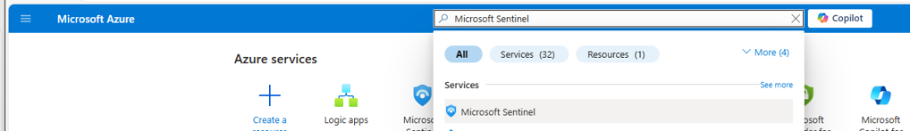](../Images/Sentinel1.png)
   - Once that is done it will Load a page sharing the Microsoft Sentinel environment , Choose Create Microsoft Sentinel
     [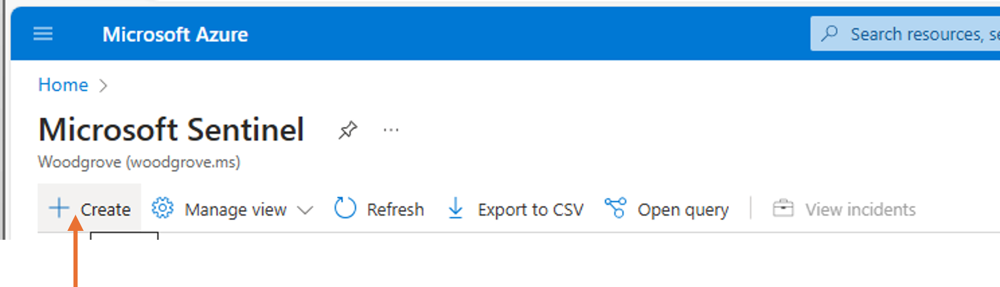](../Images/Sentinel2.png)
   - Next , you will be required to Set up a Microsoft Sentinel Workspace , proceed to click and add details for your workspace ( Name resource group etc)
     [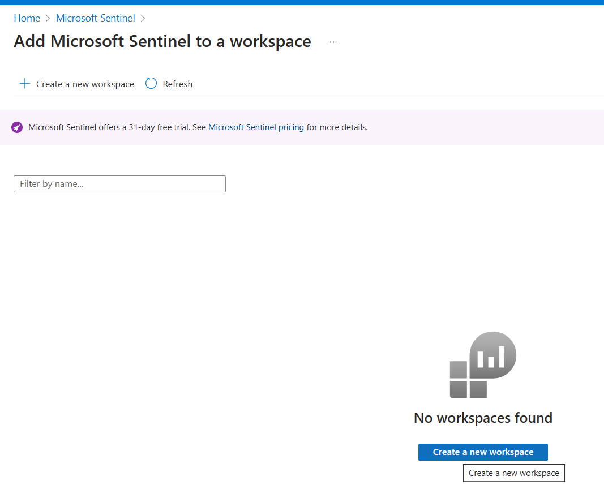](../Images/Sentinelprompt2.png)
   - Once you have added the details , Click on create and this will confirm the set up ( **please note that when you activate it, it will enable a free trial for 30 days that should suffice for the lab exercises**
 [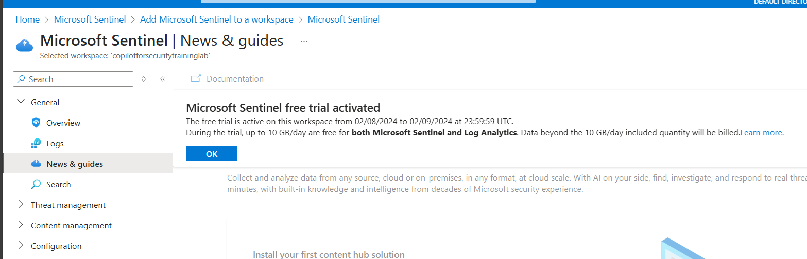](../Images/Sentinelprompt3.png)

### Action 2: Access the Content Hub to set up the Microsoft Sentinel Training Lab
1. **Navigate to the Content Hub:**
   - Once you have completed the above steps , you will be provided with a Microsoft Sentinel environment, Proceed to Click on the Content Hub Button
     [](../Images/Sentinel3.png)
2. **Search for the Microsoft Sentinel Training Lab:**
   - In the search bar, type "Microsoft Sentinel Training Lab".
   - Click on the "Microsoft Sentinel Training Lab" from the search results.
 [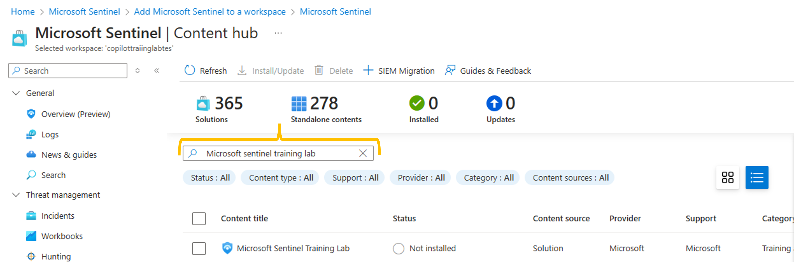](../Images/Sentinel4.png)

3. **Install the Training Lab:**
   - Click on the "Install" button.
   
   [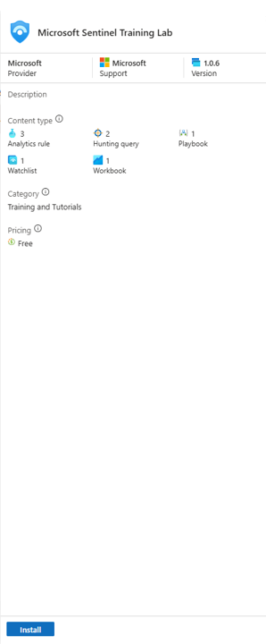](../Images/Sentinel5.png)
   - Follow the instructions in the wizard to complete the installation.
   [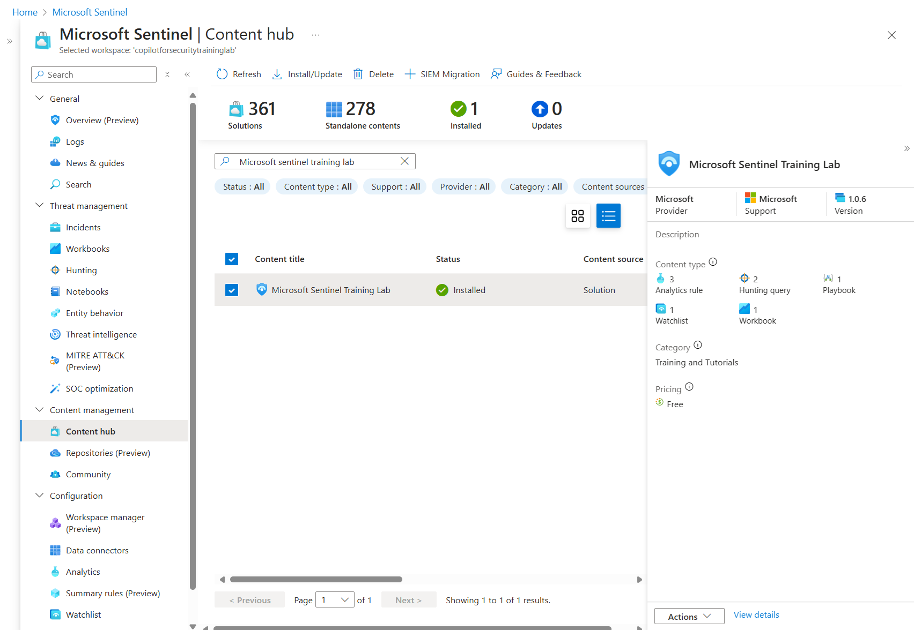](../Images/Sentinelprompttraininglab.png)
     
**Important note**: the full deployment process takes **~15min**, the main reason behind this, is to make sure that once you start using the lab, all the data is fully ready for you to use.  
### Action 3: Explore the Training Lab Features
1. **Simulate Real-World Incidents:**
   - The lab uses pre-recorded data ingested into custom log tables to simulate real-world incidents.
   - The data includes logs from various sources like SecurityEvent_CL, SigninLogs_CL, and OfficeActivity_CL.
   - In this case it will simulate Real world incidents with Dummy data that we will use in our Exercise, you can check this by going to the Incidents tab on your sentinel workspace , and you will see 3 incidents (**please note this will only be visibile if the lab has succesffully be installed**)
   
[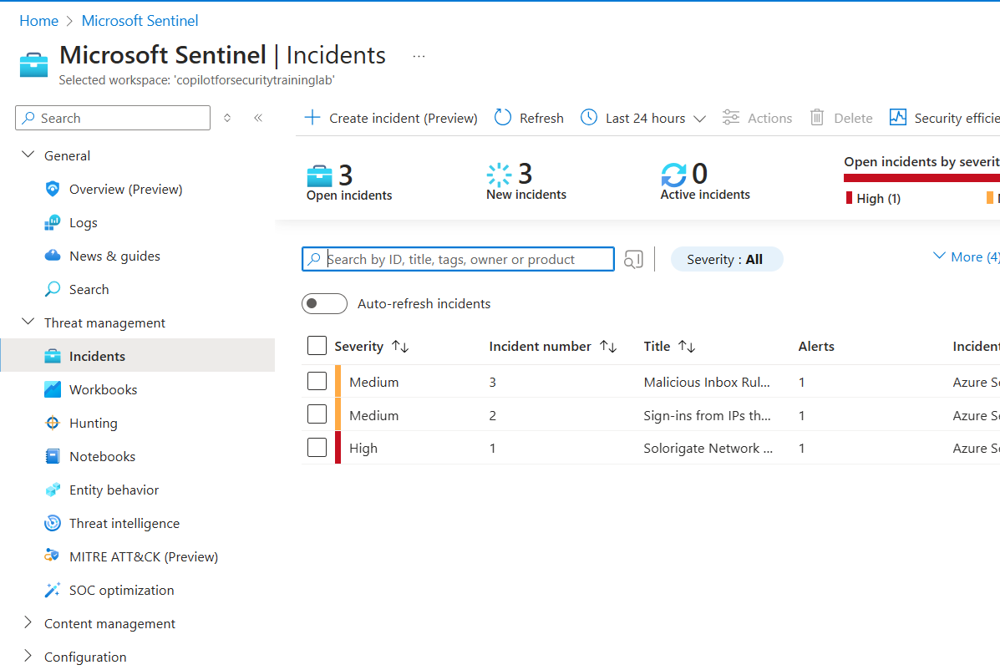](../Images/Sentinelprompt4.png)


## Exercise 2: Setting up the Microsoft Sentinel Connector on Microsoft Copilot for Security
1. Navigate to the Standalone Portal:
2. On the prompt Bar , click on the Sources button
3. On the Sources Button under Microsoft , scroll through and look for the **Microsoft Sentinel (preview)**, make sure to Toggle on the connector to allow you to enable the plugin 

[](../Images/Sentinelprompt5.png)

4. Configure the sentinel Workspace  , what is required here is to provide the following details from the training lab ( Sentinel workspace , Resource Group and Subscription Name)
   
[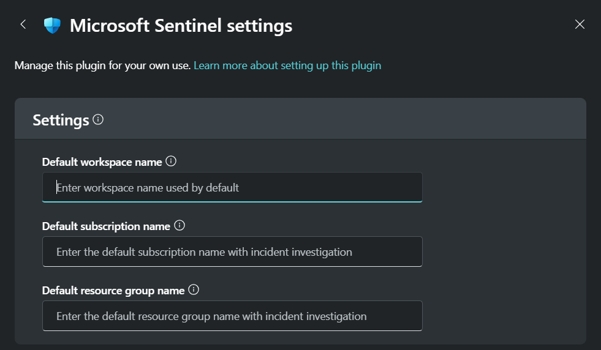](../Images/Sentinelprompt6.png)

## Exercise 3: Incident Triage , Management and Reporting using Copilot for Security for Sentinel Incidents

1.  The first prompt is to determine what are the latest incidents are in your Microsoft Sentinel environment, this should list the incidents published through the training lab we created above
```
Can you share the latest sentinel Incidents
```

[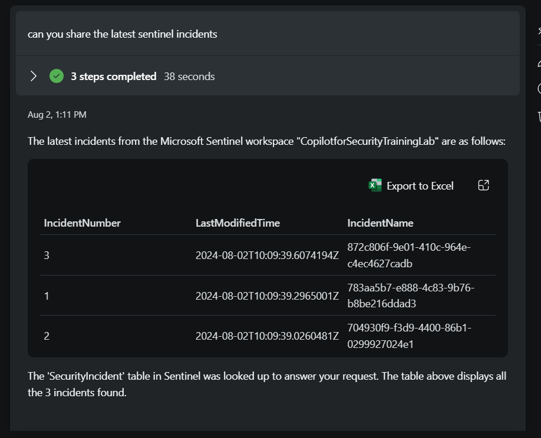](../Images/Sentinelprompt7.png)

2. The Second Prompt is to Narrow down into a specific Incident , based of the previous listed incidents , we will narrow down into the one with High Severity , in my instance this incident is Incident number 1 . proceed with typing the following prompt
```
Can you tell me more about sentinel incident 1
```

**Please note : The following for an accurate lab experience: The incident numbers presented in the Lab may vary. It is crucial to select the incident titled “Solarigate Network Beaconing” to ensure that the lab scenarios are consistent with the activities you undertake.**

[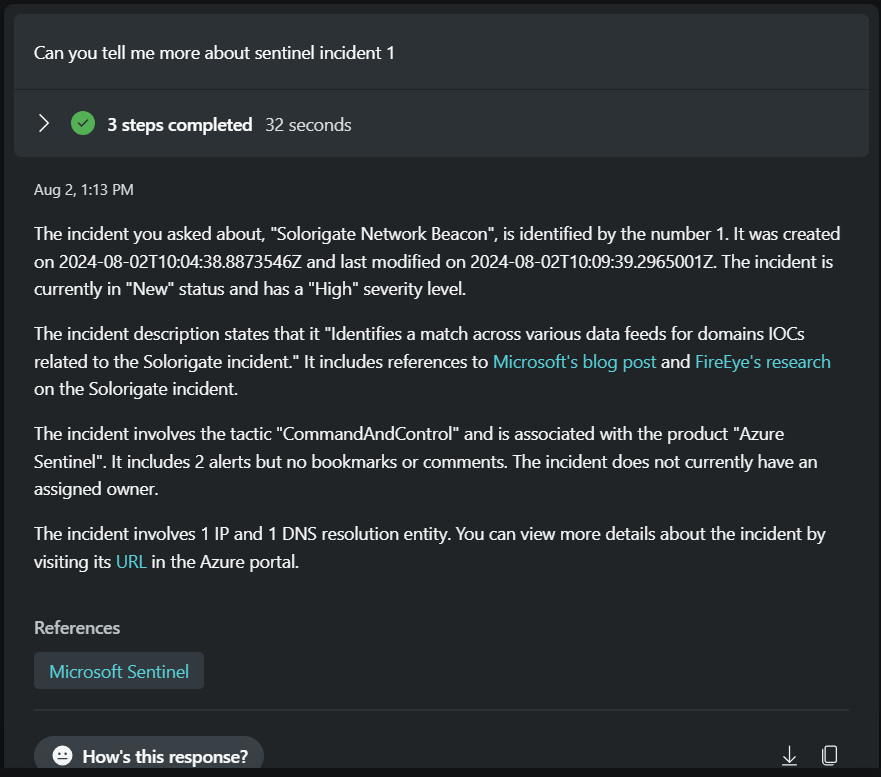](../Images/Sentinelprompt8.png)

3. The next prompt is to determine what are the Entities associated with the incident 
```
Can you share the entities associated with the incident
```

[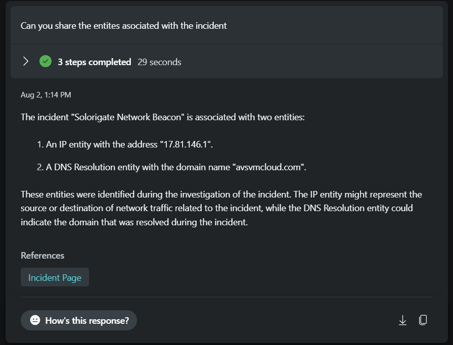](../Images/Sentinelprompt9.png)

4. The next prompt is to determine if the entites are extracted are associated with any known threats by leveraging threat intelligence
```
Can you give me the reputation score associated with both the entities identified above
```

[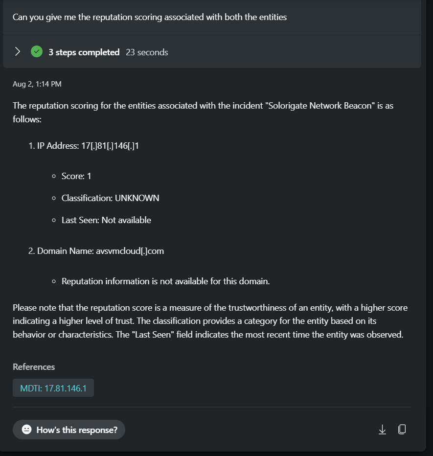](../Images/Sentinelprompt10.png)

5. For the next prompt , we would want to summarize the steps we have taken in the investigation and generate a report of the incident while adding conclusions and recommendations 
```
/AskGpt Can you generate a report of the incident and the investigation steps taken and add conclusions and recommendations to respond to this incident
```

[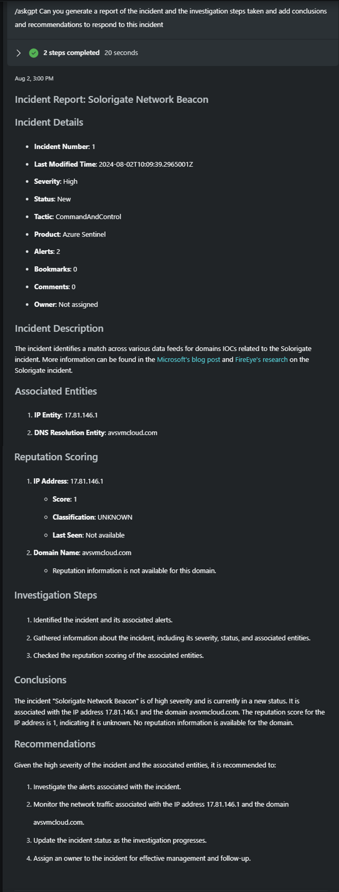](../Images/Sentinelprompt11.png)

## Exercise 4: Generating Hunting Queries to Hunt for Information in Your Sentinel Environment 

1. For this, we shall proceed to look at the second incident. Type in the following prompt:
    ```
    Can you tell me more about Sentinel incident number 2
    ```
    **Please note : The following for an accurate lab experience: The incident numbers presented in the Lab may vary. It is crucial to select the incident titled “Sign-ins from IPs that attempt sign-ins to disabled accounts."" on this prompt**

    [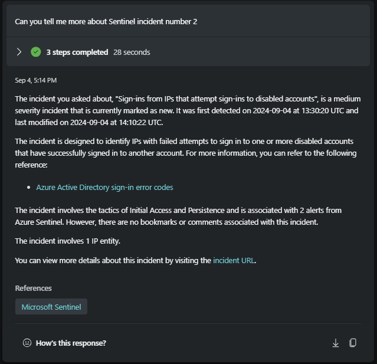](../Images/incident2.png)

2. Before proceeding to the next prompt, ensure that we have the right skills enabled. As we will be proceeding with a hunting query, we will leverage the Natural Language to KQL skill. Ensure that the skill is enabled on Copilot for Security.

    Proceed to the prompt bar, select "Sources," and within the Microsoft area, ensure the following **Toggle** for "Natural Language to KQL for Microsoft Sentinel (preview)" is enabled.

    [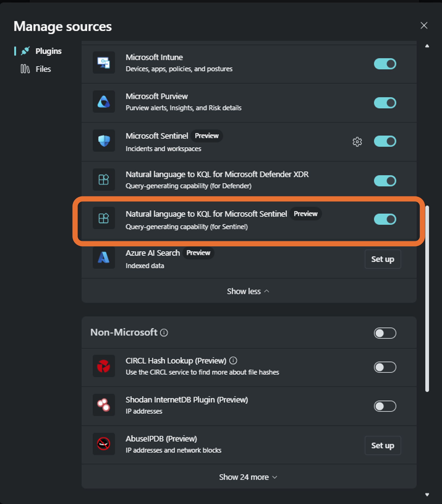](../Images/NL2KQLSentinel.png)

3. As mentioned in the earlier module, one of the capabilities of Copilot for Security is generating KQL queries from natural language prompts. It takes it a step further by connecting to your environment and actually executing the query. In this case, we will run a prompt and hunt for any other alerts associated with the entities in the incident.
    ```
    Can you hunt my Sentinel environment for any other alerts associated with the entities in this incident and show the Query
    ```
    [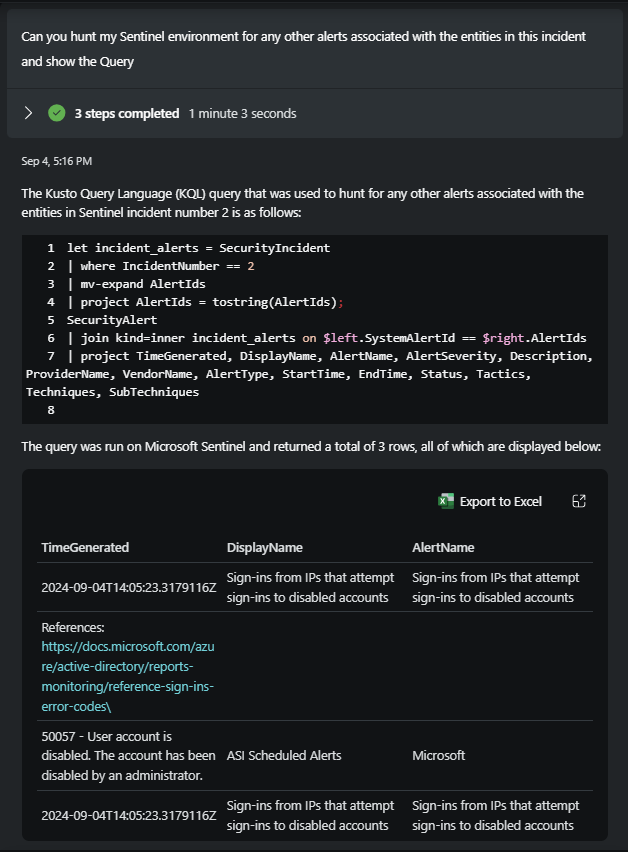](../Images/Sentinelhuntpicture.png)


Click [here](Module-8-Automation-with-Logic-Apps.md) to complete the next Module.


