## Module 8: Automation with Logic apps in Copilot for Security

#### ⌛ Estimated time to complete this lab: 30 minutes
#### 🎓 Level: 200 (Proficient to Expert level)

Logic app connector documentation: [Link](https://learn.microsoft.com/en-us/security-copilot/connector_logicapp)

#### Objectives
Upon completing this technical guide, you will gain the following abilities:

* Deploy an Azure Logic Apps capable of handling Microsoft Copilot for Security prompts using the Logic app connector.
* Leverage the Microsoft Copilot For Security GitHub to access logic app samples for testing.

#### Prerequisites
To successfully complete this task, you must meet the following prerequisites:

1. You need your own tenant and Microsoft Copilot for Security instance.
2. **Azure Subscription**: You need an active [Azure subscription](https://azure.microsoft.com/en-us/free/) to create and deploy a Logic App.
3. **Azure Resource Group**: Logic Apps are deployed within [Azure resource groups](https://docs.microsoft.com/en-us/azure/azure-resource-manager/management/manage-resource-groups). Ensure that you have an appropriate resource group created or create one during the deployment process.
4. **Access Permissions**: Ensure that you have the necessary [permissions](https://docs.microsoft.com/en-us/azure/role-based-access-control/overview) to create resources in the Azure subscription and resource group where you plan to deploy the Logic App.
---

#### **Exercise 1: Deploying Threat Article Bulletin Logic App**

In this **Guided Lab**, participants will be instructed on deploying a Logic App that is configured to generate threat bulletins from Microsoft Defender Threat Intelligence (MDTI) using Copilot for Security. The lab will detail the steps necessary to set up the Logic App for collecting threat intelligence, crafting bulletins, and automating their distribution to a specified email address.

#### Steps to Follow 
The procedure will utilize a pre-existing Logic App template. Your only requirement is to click on the designated deployment button to initiate the Logic App.
- Proceed to Deploy

### Deployment Instructions

1. After clicking on the **Deploy** button, you will be directed to the Microsoft Azure Portal. You will need to select a **Resource Group** (you can use the same resource group that you set up for the Copilot for Security instance), **Region**, and **Email** (please ensure this is the email where you want the report to be sent).

[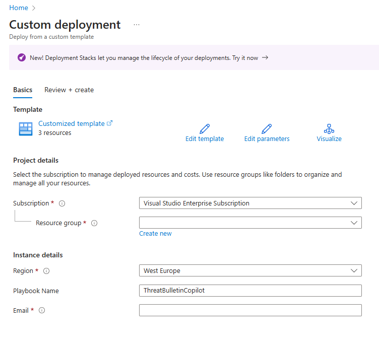](../Images/deploy1.png)

2. After entering the details, click on the **Review and create** button, followed by the **Create** button.

3. Once this is done, you will receive a notification that the logic app has been successfully deployed and is complete.

[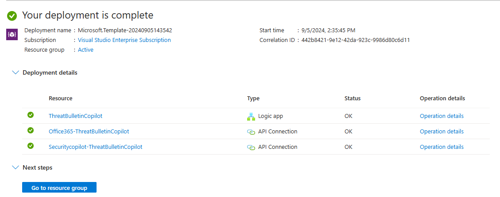](../Images/deploy2.png)

4. Click on the resource named **ThreatBulletinCopilot** to navigate to the Logic App page.

[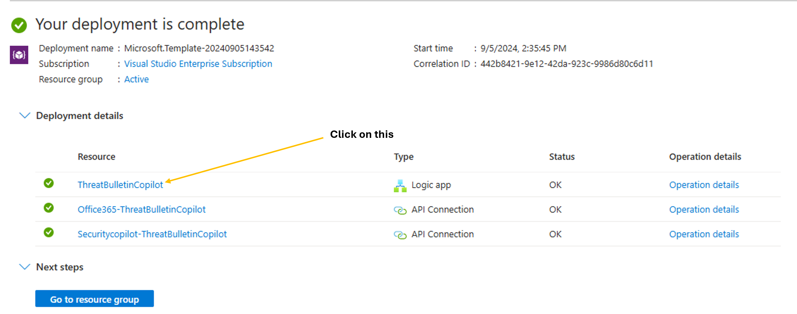](../Images/deploy3.png)

5. On the Logic App page, click on **Development Tools** and then select **Logic App Designer**.

[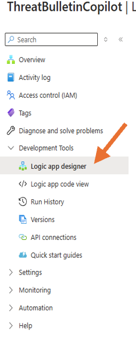](../Images/deploy5.png)

6. You will now see the Logic App in its design phase.

[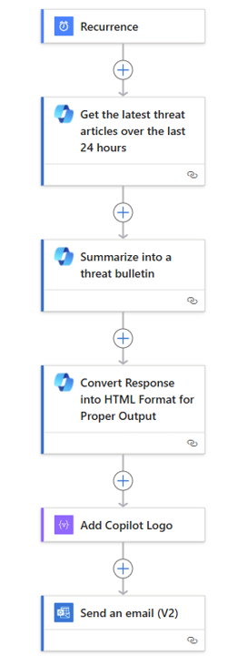](../Images/deploy6.png)

7. The next step is to authenticate the Copilot prompts with a user who has access to Copilot for Security and authenticate with an email to allow the disbursement of the report once the summary has been created by Copilot for Security.
To do this, proceed to **API Connections** in the menu.

[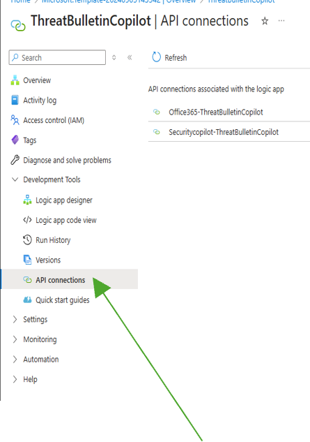](../Images/deploy7.png)

9. Select the provided API connections, starting with the **Copilot for Security** connection. This will open a new window. Under the **General** section, select **Edit API Connection** and then click on the **Authorize** button.

[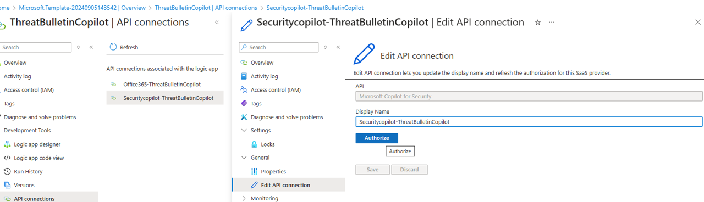](../Images/deploy8.png)

10. After clicking on **Authorize**, a new window will appear asking you to sign in with the user credentials for Copilot for Security. Once you provide the **Credentials** it will then authenticate , the next action is to click on the **Save** button .

[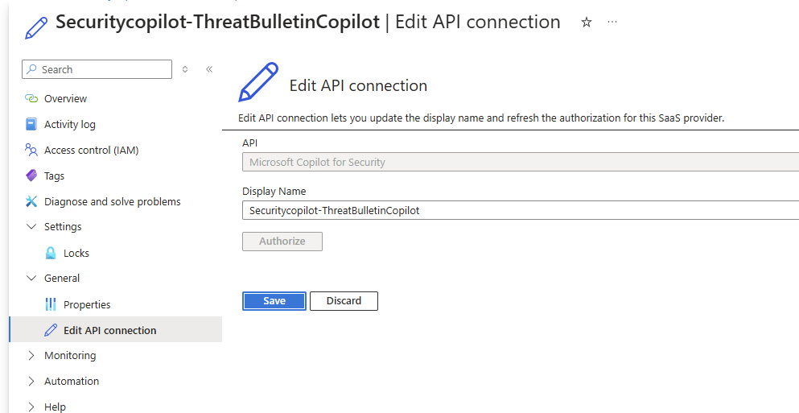](../Images/deploy9.png)

11. Repeat the same actions for the next connection, **Office365-ThreatBulletinCopilot**.

12. After finishing this , Navigate back to the logic app Overview page and Click on the **Run** Button to start the logic app.

[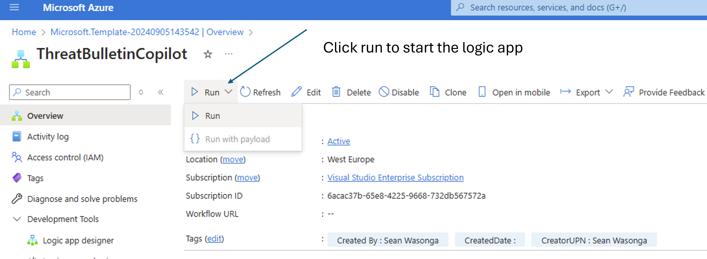](../Images/deploy10.png)

After successfully running the Logic app , you should be surfaced with an image showing a succesfull run when you on the overview page .

[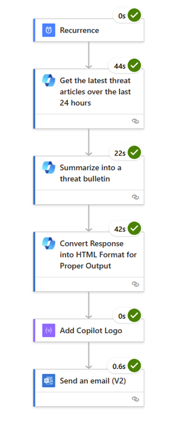](../Images/deploy11.png)

#### Review the outcome of the Logic app run 

The primary objective is to showcase a summary of the latest threat intelligence articles that have been published. This can be achieved in two ways:

1. **Standalone Portal**: 
   - Go to **securitycopilot.microsoft.com**.

   - Sign in and click on the **Sessions** tab in the menu.
  
   [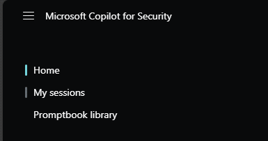](../Images/deploy12.png)
   
   - You will see the latest session showing the logic app run. Click on it to view the outcome in a copilt for Security Session

   [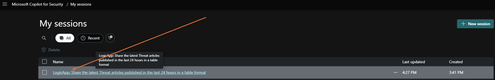](../Images/deploy13.png)
   
   - Outcome of the report ( summarized Threat bulletins )
  
   [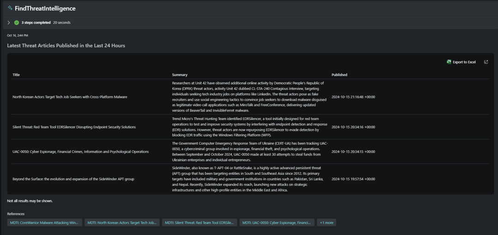](../Images/deploy14.png)

   [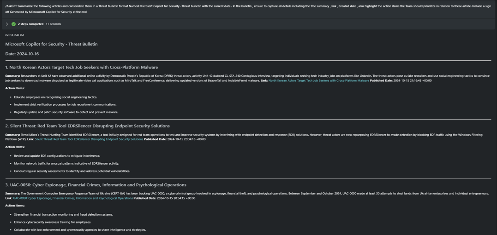](../Images/Threatbuletin2.png)

   

3. **Email Report**:
   - Check the email where the report generated by the Copilot for Security run was sent.
   - Go to the designated email inbox and open the latest email message.
     
   [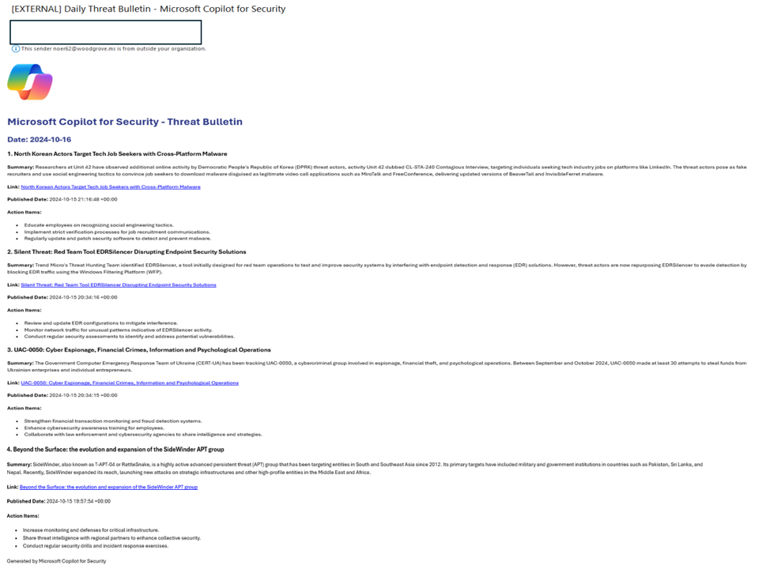](../Images/deploy15.png)

---

#### **Bonus Module: Test the additional playbooks on Github and Create your own**

- Access the Logic app folder on the GitHub: [Azure Copilot For Security - Logic Apps](https://github.com/Azure/Copilot-For-Security/tree/main/Logic%20Apps)

   

- Proceed to Deploy

<!---Click [here](https://aka.ms/CFSDeleteSCU) to complete go to the delete SCU module and complete the Beginner & Advanced modules. Alternatively, click [here](https://aka.ms/CfSModule9) to go to the Additional Modules, starting with the Embedded Microsoft Defender experience. Please remember you will need to allocate more SCU's to complete these modules. --->

#### Beginner and Advanced Modules are now complete!
You now have 2 options:
1. Click [here](Deleting-SCU.md) to go to the delete SCU module and finish the course. You may re-install Security Copilot at a later date if you wish to continue on to the additional modules. 
2. Click [here](AdditionalSCUs.md) to continue on to the additional modules and add the extra SCUs needed.
