<h1> Module 9 -Embedded Features in Microsoft Defender</h1>

<h4>🎓 Level: 200 (Advanced)<h4>

<h4>⌛ Estimated time to complete this lab: 30 minutes</h4>

<h2>Objectives </h2>
This module showcases some powerful features that become available in Microsoft Defender when Microsoft Security Copilot is enabled. Features focus on improving incident response, threat hunting, understanding code, and generally moving faster when using Microsoft Defender. 

This model will stay within Microsoft Defender, however, know you can always pivot out of Microsoft Defender directly into the stand-alone Microsoft Security Copilot interface to continue your work reasoning on other resources such as Microsoft tools, threat intelligence, and 3rd party tools. 

<h4>Note: Similar outcomes can be accomplished using the standalone Microsoft Security Copilot dashboard as seen within the embedded experience. </h4>
<h2>Prerequisites </h2>

* You have Microsoft Security Copilot enabled

* You have added the necessary amount of SCU's to complete the Additional Modules (15 SCUs if continuing directly on from the Beginner and Advanced Modules or 8 if you have re-installed Security Copilot).

* You must have access to Microsoft Defender in the same tennant as Microsoft Security Copilot so Security Copilot features are available in Microsoft Defender  

<h2>Exercise 1: Accessing Microsoft Defender Investigation AI Capabilities</h2>

At this point, we assume you have completed step one and have at least read only access to Microsoft Defender, which exists in the same tenant as Microsoft Security Copilot. 

1: Open Microsoft Defender by going to Defender.Microsoft.com

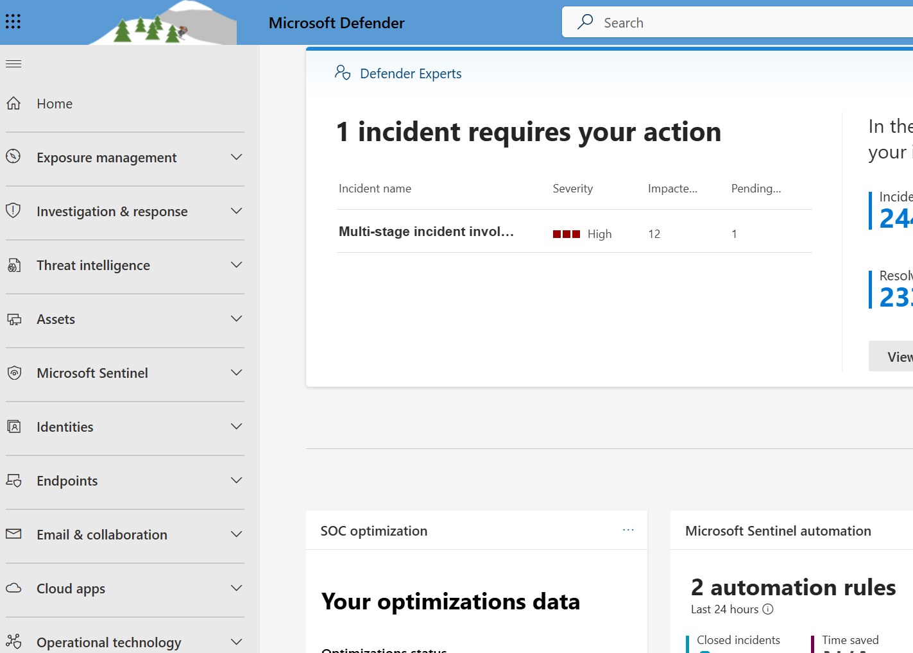

2: Let’s look at features you can use during an investigation of a potential incident. Click Incidents & alerts then click Incidents

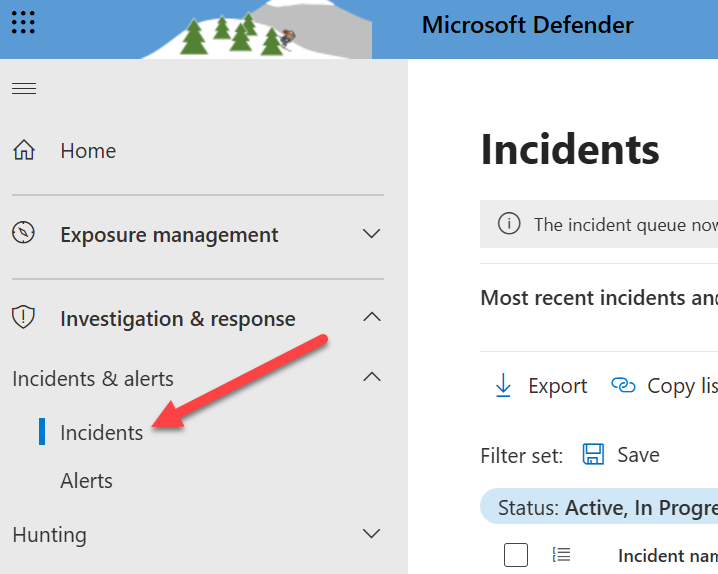

3: Choose an incident that is interesting. For the next example, I’m selecting one about data exfiltration. Yours can be something else. 

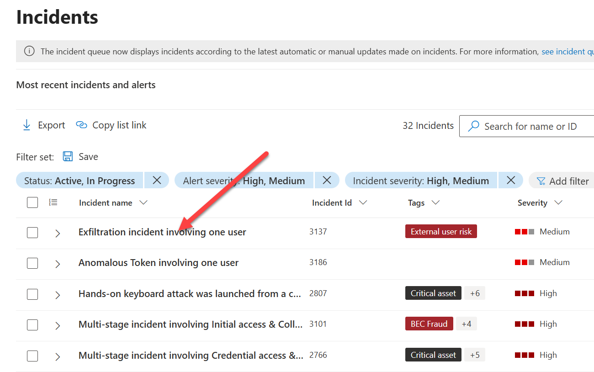

The first Microsoft Security Copilot feature you will notice is how an Incident Summary will pop up on the right side. This will give you a quick summary of what is going on with this incident. You may also see a wizard popup if this is your first time using Security Copilot as I’m showing in my example. 

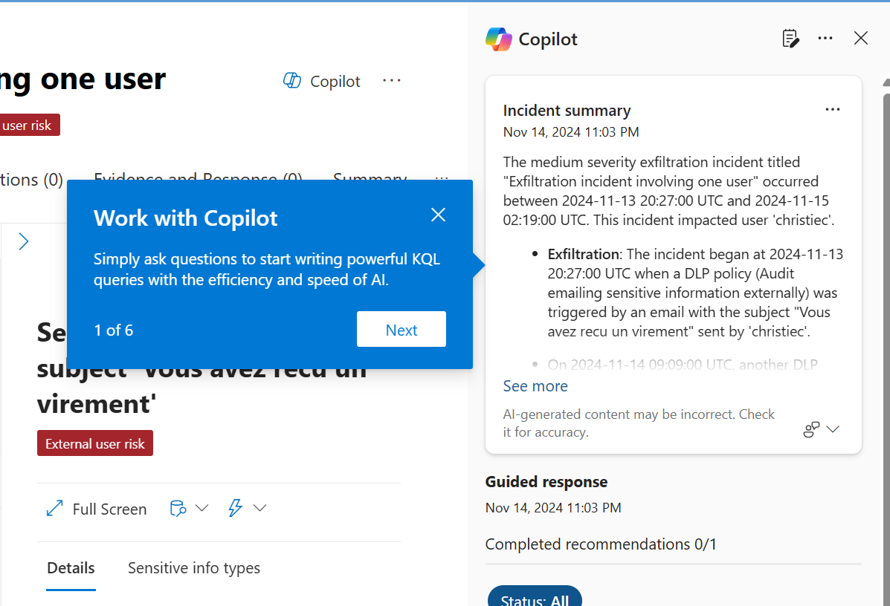

<h2>Exercise 2: Guided Response</h2>
4: Under the summary you will find any Guided Response recommendations. I chose another incident that had multiple recommendations for the next image. What you will see will depend on the incident you are investigating. This example is a multi-stage incident so Security Copilot is recommending to classify the incident, containment options (this example is recommending disabling a specific user's account), and a remediation step involving resetting the associated users account. 

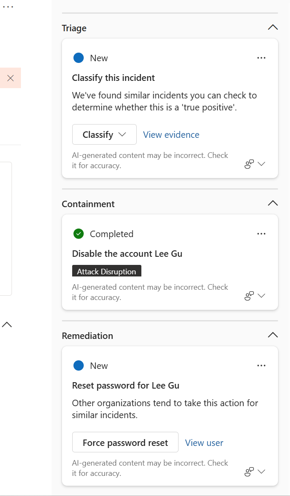

<h2>Exercise 3: Incident Report </h2>

5:Next let’s explore how Microsoft Security Copilot can provide a much deeper summary of what is going on. Go to the right corner and click the notebook icon. 

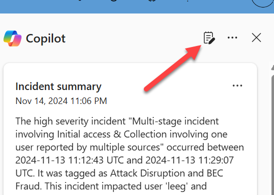

6: It will take a minute or more to create your report. Once completed, you will see a detail report containing a ton of details about the current incident you are investigating. In my example, the summary explains critical details including who accesses what, what actions have been taken, and recommended remediation actions. 

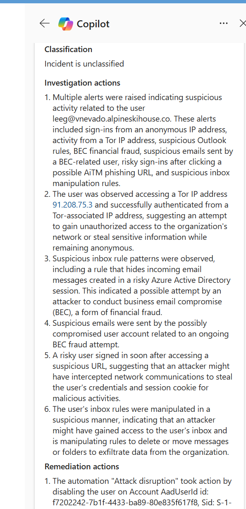

<h2>Exercise 4: Pivoting to stand alone Microsoft Security Copilot </h2>

7: This information is super useful, and the value doesn't stop here. You use this information in a few different ways including exporting it to the stand-alone version of Microsoft Security Copilot. To use this data, click the three dots and choose to Open in Copilot for Security. 

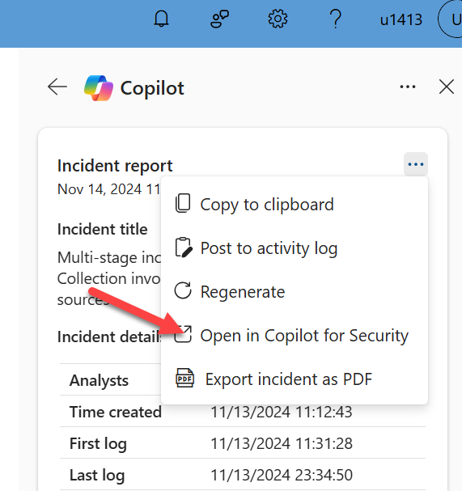

8: You should see a window pop up that automatically logs you into the standalone Microsoft Security Copilot. You will also see all of the details found in your report summary imported allowing you to continue your investigation within the stand-alone Security Copilot. From this point, you could ask what threat intelligence is seeing regarding aspects of the findings. You could see what other tools are seeing such as more information on the associated users via Microsoft Intune. 

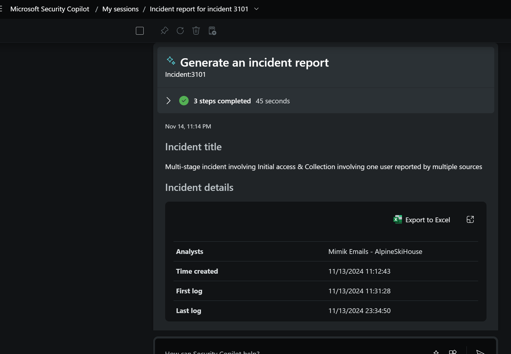

<h2>Exercise 5: Analyzing Code </h2>

9: One final thing to try out is the power of AI reverse engineering and explaining code. Go back to the Incidents section and defender. Click into a incident that has potential scripts and code. You will notice a Analyze button. Try it out by clicking it. 

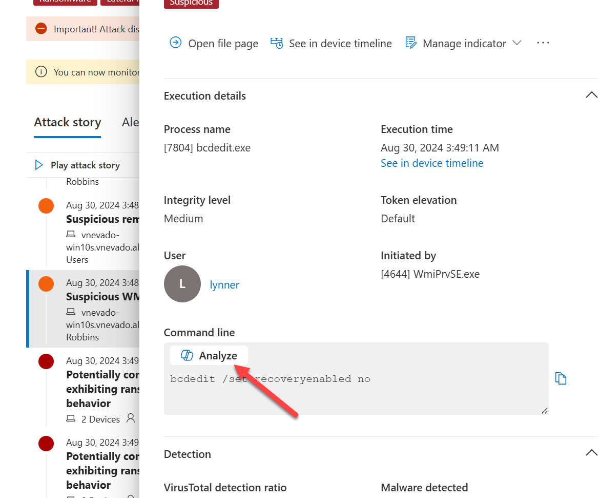

10: You will find Microsoft Security Copilot will open a new window that explains what the code is. You may also see other options such as showing the code or associated MITRE techniques associated with the code. My example is very basic, but you should get the point and see the potential. Also know you could launch directly into the stand-alone version of Security Copilot with the associated content to dig deeper into the code you are analyzing. 

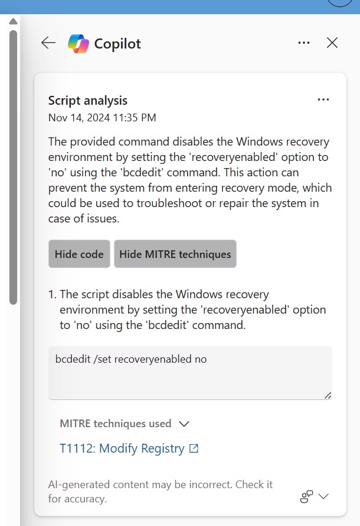

<h4>These are just some of the powerful features that become available in Microsoft Defender when Microsoft Security Copilot is enabled.</h4>

Please click <a href="Module-10-eDiscovery-Search-in-Microsoft-Purview.md">here</a> to go to the next Advanced Module (E-Discovery in Microsoft Purview) or click <a href="Deleting-SCU.md">here</a> to delete the SCUs and complete the course.
