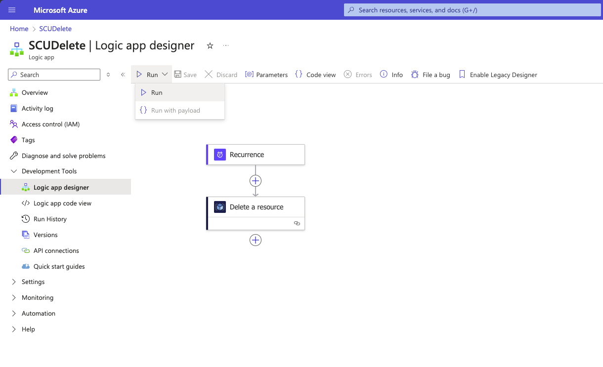
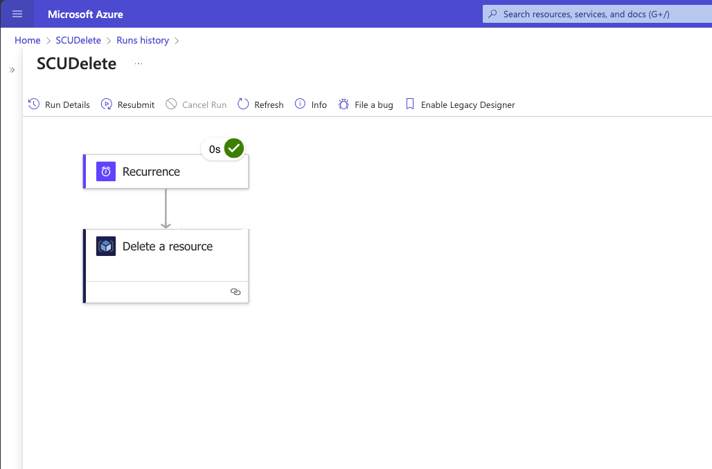

# Resume the CFS Hands On Lab

Click Run > Run to trigger the Logic App.

Once the Logic App is running you should be redirected to a screen similar to below.

You can now move on to the next module and resume where you left off.
